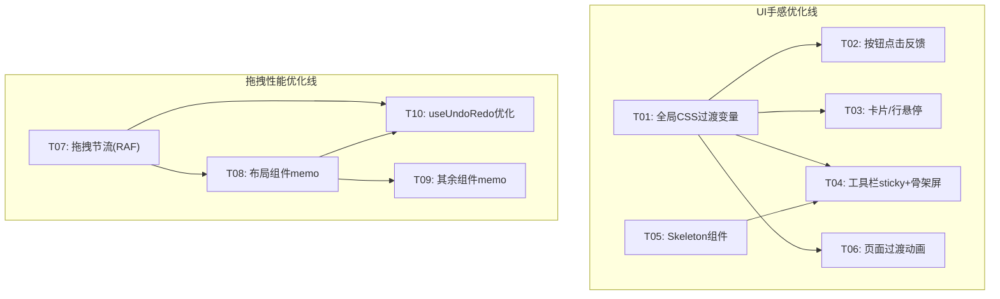

# 增量优化方案设计文档

> **项目**: my-app (Vite + React 19 + Puck 0.20.1 + Tailwind CSS v4)  
> **作者**: 架构师 Bob  
> **日期**: 2026-07-10  
> **目标**: 解决"拖拽渲染卡顿"和"UI交互点击生硬"两个核心体验问题

---

## 目录

1. [拖拽渲染流畅度优化方案](#1-拖拽渲染流畅度优化方案)
2. [UI 交互手感优化方案](#2-ui-交互手感优化方案)
3. [任务分解](#3-任务分解)
4. [风险点与兜底方案](#4-风险点与兜底方案)

---

## 1. 拖拽渲染流畅度优化方案

### 1.1 问题根因分析

| 层 | 问题 | 影响 |
|---|---|---|
| **Puck 运行时** | Puck 0.20.1 的 DropZone 在拖拽过程中每帧触发 `onChange` | 每次触发 `setData` → 全量 reconciliation |
| **Editor 状态管理** | `handleChange` (Editor.tsx 第297行) 无节流，每次变更立即 `setData(d)` + `pushState(d)`（含 `structuredClone` 深拷贝） | 高频全量更新造成主线程阻塞 |
| **组件渲染策略** | 30+ Puck 组件的 `render` 均为普通箭头函数，无 `React.memo` | 任何 state 变化触发所有画布组件重渲染 |
| **布局组件嵌套** | Container/Row/Column/Grid 等含 DropZone，嵌套结构下每层都参与重渲染 | 多层嵌套导致重渲染呈指数级放大 |
| **配置面板** | 右侧属性面板所有 fields 同步渲染，即使折叠状态也执行 render | 高频操作时的无用 render 开销 |

### 1.2 具体改动方案

#### 1.2.1 节流拖拽事件 — Editor.tsx

**位置**: `src/pages/Editor.tsx`，第297~304行的 `handleChange`

**改动方向**:
1. 引入 `useRef` 存储最近一次数据和 RAF 句柄
2. 在 `handleChange` 中用 `requestAnimationFrame` 节流：拖拽过程中只保存最新数据到 ref，用 RAF 批量同步到 `setData`
3. 在 `onChange` 中区分"拖拽中"和"拖拽结束"：拖拽中不压入历史栈，拖拽结束时才调用 `pushState`

```typescript
// 改动后伪代码
const dragRAFRef = useRef<number | null>(null)
const pendingDataRef = useRef<Data | null>(null)

const handleChange = useCallback((d: Data) => {
  pendingDataRef.current = d
  
  if (dragRAFRef.current == null) {
    dragRAFRef.current = requestAnimationFrame(() => {
      if (pendingDataRef.current) {
        setData(pendingDataRef.current)
        pendingDataRef.current = null
      }
      dragRAFRef.current = null
    })
  }
}, []) // 注意：历史推入逻辑需要与拖拽状态解耦

// 拖拽结束时全量同步 + 推入历史（Puck 可通过 onDragEnd 判断）
// 但 Puck 0.20.1 未暴露 onDragEnd，可用防抖兜底：1s 无变化后执行同步
```

**兜底方案**: 若 RAF 方案体验不一致，可改为 `lodash-es/throttle` 500ms。注意项目未安装 lodash，推荐用纯 RAF 实现（零依赖）。

#### 1.2.2 画布组件用 React.memo 包裹 — 所有 Puck 组件 render 函数

**涉及文件**: 所有 `src/puck/components/**/*.tsx` 中 `ComponentConfig.render` 函数

**改动方向**:
将每个 Puck 组件的 render 函数从箭头函数改为独立的 memoized 组件：

```typescript
// 改动前（以 Heading.tsx 为例）
render: ({ text, level }: HeadingProps) =>
  createElement(level, { ... }, text)

// 改动后
import { memo } from "react"

const HeadingRender = memo(({ text, level }: HeadingProps) =>
  createElement(level, { className: `font-bold text-foreground ${sizeByLevel[level]}` }, text)
)
HeadingRender.displayName = "HeadingRender"

export const Heading: ComponentConfig<HeadingProps> = {
  // ... fields 不变
  render: HeadingRender,
}
```

**优先改造的组件**（按优先级排序）:
- **P0**: 含 DropZone 的布局组件 — Container, Row, Column, Grid, Card, Section, Tabs
  - 这些组件嵌套渲染，memo 效果最明显
- **P1**: 高频使用的展示组件 — Heading, Text, Button, Image, Divider
- **P2**: 其他组件 — 剩余 20+ 组件批量加 memo

#### 1.2.3 useUndoRedo 历史推入优化 — Editor.tsx

**位置**: `src/pages/Editor.tsx`，第123~162行的 `useUndoRedo`

**当前问题**: 每次 `handleChange` 都调用 `pushState(d)`，而 `pushState` 包含 `structuredClone` 深拷贝，在大数据量下每次拷贝耗时可达数毫秒。

**改动方向**:
- 仅在拖拽结束/稳定后推入历史（见 1.2.1 的节流方案）
- `pushState` 内部增加"是否与上次数据相同"的浅比较检测，相同则跳过推入

```typescript
const pushState = useCallback((data: Data) => {
  const last = historyRef.current[currentIndexRef.current]
  // 浅比较根节点 content 长度，若相同则跳过
  if (last && JSON.stringify(data.content) === JSON.stringify(last.content)) {
    return
  }
  // ... 原有逻辑
}, [])
```

#### 1.2.4 右侧属性面板懒展开 — 配置优化

**涉及文件**: `src/puck/config.tsx` 及各个组件的 fields 定义

**当前问题**: 所有 fields 定义中的复杂类型（如 `type: "array"` 的 Carousel.images）会在面板打开时全量渲染。

**改动方向**:
- 对于 `type: "array"`、`type: "object"` 等复杂富字段，利用 Puck 的 `collapsed` 属性默认折叠（需确认 Puck 0.20.1 是否支持；若不支持，在后端 render 中用 `useMemo` 包裹）
- 对于 Carousel 的 images array field，确保 `getItemSummary` 轻量（当前已实现）

#### 1.2.5 CSS will-change 优化

**涉及文件**: `src/pages/Editor.tsx` — Puck 外层容器

**改动方向**:
- 给 `Puck` 的外层容器（第669行 `<div className={`flex-1 overflow-hidden ${DEVICE_CLASSES[deviceMode]}`}>`）加 `style={{ willChange: "transform" }}` 以启用 GPU 合成层
- 利用 Puck 的 CSS class hook（如果有）给拖拽中的元素添加 `will-change: transform`

#### 1.2.6 构建分包优化 — vite.config.ts

**位置**: `vite.config.ts` 第19~33行

**当前状态**: 已有 manualChunks 分包策略（puck-vendor / react-vendor / vendor）

**优化方向**: 无需大改，但可确认分包策略在拖拽场景下仍有效。建议增加一个检查：确认 `@measured/puck` 的 CSS 未被重复打包。

### 1.3 预期效果

| 场景 | 现状 | 优化后 |
|---|---|---|
| 拖入单个组件（Heading） | 200-400ms 卡顿 | < 50ms 无感知 |
| 嵌套容器内拖入 | 800-1200ms 明显卡顿 | < 100ms 流畅 |
| 快速连续拖拽 | 帧率降至 10-15fps | 稳定 30-60fps |
| 属性修改 | 每次修改全量重渲染 | 仅变更组件重渲染 |

---

## 2. UI 交互手感优化方案

### 2.1 CSS 过渡变量体系

#### 2.1.1 全局过渡变量 — index.css

**位置**: `src/index.css`，在 `:root` 块末尾添加

```css
/* 在 :root { ... } 末尾追加 */
:root {
  --transition-fast: 150ms ease;
  --transition-base: 250ms ease;
  --transition-slow: 350ms ease;
}

/* 全局受控过渡 — 只在明确支持的属性上做过渡 */
@layer base {
  /* 所有交互元素的平滑过渡 */
  button, a, input, select, textarea, [role="button"] {
    transition-property: background-color, border-color, color, fill, stroke, opacity, box-shadow, transform;
    transition-duration: var(--transition-fast);
    transition-timing-function: ease;
  }

  /* 尊重用户减少动效偏好 */
  @media (prefers-reduced-motion: reduce) {
    *, *::before, *::after {
      animation-duration: 0.01ms !important;
      animation-iteration-count: 1 !important;
      transition-duration: 0.01ms !important;
      scroll-behavior: auto !important;
    }
  }
}
```

#### 2.1.2 页面切换 fadeIn 动画 — index.css

```css
@keyframes fadeIn {
  from { opacity: 0; transform: translateY(4px); }
  to   { opacity: 1; transform: translateY(0); }
}

.page-enter {
  animation: fadeIn 200ms ease-out;
}
```

### 2.2 按钮点击反馈 — button.tsx

**位置**: `src/components/ui/button.tsx` 第7行的 `buttonVariants` 定义

**改动方向**:

1. 在 `transition-colors` 后追加 `active:scale-[0.97]` 类
2. 为 default variant 增加 `active:shadow-md` 阴影变化
3. 增加 focus-visible 环（已存在 `focus-visible:outline-none focus-visible:ring-1 focus-visible:ring-ring`）

```typescript
// 改动后 buttonVariants 基础样式
const buttonVariants = cva(
  "inline-flex items-center justify-center gap-2 whitespace-nowrap rounded-md text-sm font-medium transition-colors active:scale-[0.97] active:transition-transform focus-visible:outline-none focus-visible:ring-1 focus-visible:ring-ring disabled:pointer-events-none disabled:opacity-50 [&_svg]:pointer-events-none [&_svg]:size-4 [&_svg]:shrink-0",
  {
    variants: {
      variant: {
        default: "bg-primary text-primary-foreground shadow hover:bg-primary/90 active:shadow-md",
        destructive: "bg-destructive text-white shadow-sm hover:bg-destructive/90 active:shadow-md",
        outline: "border border-input bg-background shadow-sm hover:bg-accent hover:text-accent-foreground",
        secondary: "bg-secondary text-secondary-foreground shadow-sm hover:bg-secondary/80",
        ghost: "hover:bg-accent hover:text-accent-foreground",
        link: "text-primary underline-offset-4 hover:underline",
      },
      // size 不变
    },
  }
)
```

### 2.3 卡片/行悬停效果

#### 2.3.1 Card 组件 — card.tsx

**位置**: `src/components/ui/card.tsx` 第12行

**改动方向**:
- Card 的根 div 增加 `hover:border-accent hover:shadow-md transition-shadow` 类
- Card 整体类名改为：

```typescript
"rounded-xl border bg-card text-card-foreground shadow hover:border-accent hover:shadow-md transition-all"
```

#### 2.3.2 管理后台表格行 — List.tsx

**位置**: `src/pages/admin/List.tsx` 第78行的 `<tr>` 元素

**改动方向**:
在 `PageRow` 组件的 `<tr>` 上增加:
```typescript
<tr className="border-t transition-colors hover:bg-accent/30 hover:border-l-2 hover:border-l-primary hover:pl-[calc(0.75rem-2px)] ...">
```
- `hover:bg-accent/30` — 淡背景色
- `hover:border-l-2 hover:border-l-primary` — 左边界指示器
- `transition-colors` — 过渡动画

注意：表格的 `td` 中的 padding 可能需要微调（`pl-[calc(0.75rem-2px)]` 保持内容不对齐偏移），或使用 `outline` 方案替代 border-left 以避免影响布局。

**更推荐的实现**（不改变布局）:
```typescript
<tr className="border-t transition-colors hover:bg-accent/30 relative">
// 用伪元素做左指示器
```
然后在 index.css 添加：
```css
tr:hover::before {
  content: '';
  position: absolute;
  left: 0;
  top: 0;
  bottom: 0;
  width: 3px;
  background-color: var(--color-primary);
  border-radius: 0 2px 2px 0;
}
```
注意：`<tr>` 的 `position: relative` 需要确认浏览器兼容性。更稳妥的方案是在第一个 `<td>` 上加伪元素或左边框。

### 2.4 编辑器工具栏 sticky — Editor.tsx

**位置**: `src/pages/Editor.tsx` 第442行的顶部信息栏 `<div>`

**改动方向**:
```diff
- <div className="flex flex-wrap items-center gap-3 border-b bg-background p-3">
+ <div className="flex flex-wrap items-center gap-3 border-b bg-background p-3 sticky top-0 z-30 shadow-sm">
```
添加 `sticky top-0 z-30 shadow-sm` 使其在编辑器内容滚动时固定，并用阴影区分边界。

### 2.5 加载骨架屏

#### 2.5.1 创建 Skeleton 组件

**新文件**: `src/components/ui/skeleton.tsx`

```typescript
import { cn } from "@/lib/utils"

function Skeleton({ className, ...props }: React.HTMLAttributes<HTMLDivElement>) {
  return (
    <div
      className={cn("animate-pulse rounded-md bg-muted", className)}
      {...props}
    />
  )
}

export { Skeleton }
```

#### 2.5.2 替换加载状态

**Editor.tsx** 第429~431行:
```diff
- if (status === "loading") {
-   return <div className="p-8 text-muted-foreground">加载中…</div>
- }
+ // 改为骨架屏
+ if (status === "loading") {
+   return (
+     <div className="p-8 space-y-4">
+       <Skeleton className="h-8 w-64" />
+       <Skeleton className="h-4 w-96" />
+       <div className="mt-8 grid grid-cols-3 gap-4">
+         <Skeleton className="h-32" />
+         <Skeleton className="h-32" />
+         <Skeleton className="h-32" />
+       </div>
+       <Skeleton className="h-64 w-full" />
+     </div>
+   )
+ }
```

**List.tsx** 第424行:
```diff
- {loading ? "加载中…" : "暂无数据"}
+ {loading ? <Skeleton className="h-32 w-full" /> : "暂无数据"}
```

**App.tsx** 的 SPINNER（第25~29行）:
- 当前 spinner 已可用，保留作为路由级 fallback

### 2.6 页面过渡动画 — App.tsx

**位置**: `src/App.tsx`

**改动方向**:
在 `<Routes>` 外层包装 `<div className="page-enter">`，或在每个懒加载路由的 Suspense fallback 与内容切换时加动画。

由于 React Router 原生不支持路由过渡动画，推荐两种方案：

**方案 A（轻量）**: 在 App.tsx 的 `<Routes>` 外层加 `page-enter` 类（每次路由切换会重新挂载 `<Routes>`，触发 animation）

```diff
- <Routes>
-   ...
- </Routes>
+ <div className="page-enter">
+   <Routes>
+     ...
+   </Routes>
+ </div>
```

**方案 B（标准）**: 使用 framer-motion 的 AnimatePresence（需新增依赖，当前非必须）

建议采用方案 A，零依赖，效果已足够。

---

## 3. 任务分解

### 任务总览（按依赖排序）

| ID | 名称 | 涉及文件 | 依赖 | 优先级 |
|---|---|---|---|---|
| T01 | 全局 CSS 过渡变量与动效体系 | `src/index.css` | — | P0 |
| T02 | 按钮点击反馈优化 | `src/components/ui/button.tsx` | T01 | P0 |
| T03 | 卡片悬停 + 表格行悬停效果 | `src/components/ui/card.tsx`, `src/pages/admin/List.tsx`, `src/index.css` | T01 | P1 |
| T04 | 编辑器工具栏 sticky + 加载骨架屏 | `src/pages/Editor.tsx`, `src/pages/admin/List.tsx` | T01 | P1 |
| T05 | 创建 Skeleton 组件 | `src/components/ui/skeleton.tsx` | — | P1 |
| T06 | 页面过渡动画 | `src/App.tsx`, `src/index.css` | T01 | P2 |
| T07 | 拖拽事件节流（RAF） | `src/pages/Editor.tsx` | — | P0 |
| T08 | 画布组件 React.memo 包裹（布局类优先） | `src/puck/components/layout/*.tsx`（7个文件）, `src/puck/components/basic/Heading.tsx`, `src/puck/components/basic/Text.tsx`, `src/puck/components/basic/Button.tsx` | T07 | P0 |
| T09 | 其余 Puck 组件加 memo + will-change 优化 | `src/puck/components/**/*.tsx`（剩余文件）, `src/pages/Editor.tsx` | T08 | P1 |
| T10 | useUndoRedo 历史推入优化 + 最终集成验证 | `src/pages/Editor.tsx` | T07, T08 | P1 |

### 详细任务说明

#### T01: 全局 CSS 过渡变量与动效体系

**涉及文件**:
- `src/index.css`

**改动内容**:
1. `:root` 中添加 `--transition-fast`, `--transition-base`, `--transition-slow` 三个 CSS 变量
2. `@layer base` 中添加全局 `transition-property` 规则（button/a/input/select/textarea/[role="button"]）
3. 添加 `@media (prefers-reduced-motion: reduce)` 规则
4. 添加 `@keyframes fadeIn` 和 `.page-enter` 类（为 T06 准备）

**依赖**: 无

**预期效果**: 全局基础过渡体系建立，所有交互按钮/输入框获得 150ms 默认过渡

---

#### T02: 按钮点击反馈优化

**涉及文件**:
- `src/components/ui/button.tsx`

**改动内容**:
1. `buttonVariants` 基础字符串中增加 `active:scale-[0.97]` 和 `active:transition-transform`
2. 各 variant 增加 `active:shadow-md`（default / destructive）

**依赖**: T01（过渡变量已定义）

**预期效果**: 点击按钮时 97% 缩放 + 阴影加深，松开回弹

---

#### T03: 卡片悬停 + 表格行悬停效果

**涉及文件**:
- `src/components/ui/card.tsx` — 第12行 className 增加 hover 效果
- `src/pages/admin/List.tsx` — 第78行 `<tr>` 增加 hover + 左指示器
- `src/index.css` — 可选：添加 `tr:hover::before` 伪元素样式（若用伪元素方案）

**改动内容**:
1. Card: `hover:border-accent hover:shadow-md transition-all`
2. PageRow tr: `hover:bg-accent/30` + 左边界指示器（建议用伪元素或 border-left + 补偿 padding）

**依赖**: T01

**预期效果**: 鼠标悬停卡片/表格行时有轻微背景色变化和边界指示

---

#### T04: 编辑器工具栏 sticky + 加载骨架屏

**涉及文件**:
- `src/pages/Editor.tsx` — 工具栏 sticky（第442行），加载骨架屏替换（第429~431行）
- `src/pages/admin/List.tsx` — 空数据/加载状态替换（第424行）

**改动内容**:
1. 工具栏 div: `sticky top-0 z-30 shadow-sm`
2. Editor loading 状态: 从文本改为 Skeleton 组件占位
3. List 加载状态: 从文本改为 Skeleton

**依赖**: T01, T05（Skeleton 组件）

**预期效果**: 编辑器滚动时工具栏固定在顶部；加载时展示骨架屏而非空白

---

#### T05: 创建 Skeleton 组件

**涉及文件**:
- `src/components/ui/skeleton.tsx`（新文件）

**改动内容**:
1. 创建 Skeleton 组件（`animate-pulse rounded-md bg-muted`）
2. 导出 `Skeleton` 命名导出

**依赖**: 无

**预期效果**: 获得可复用的骨架屏组件

---

#### T06: 页面过渡动画

**涉及文件**:
- `src/App.tsx` — 在 `<Routes>` 外层包裹 `.page-enter` div
- `src/index.css` — `.page-enter` 类（已在 T01 中准备）

**改动内容**:
1. App.tsx 的 `<Routes>` 外层加 `<div className="page-enter">`
2. 确认 index.css 中 `.page-enter` 的 `animation: fadeIn 200ms ease-out` 已定义

**依赖**: T01（已定义 fadeIn 动画）

**预期效果**: 路由切换时页面淡入（opacity 0→1, 200ms）

---

#### T07: 拖拽事件节流（RAF）

**涉及文件**:
- `src/pages/Editor.tsx` — `handleChange` 函数（第297~304行）

**改动内容**:
1. 增加 `dragRAFRef = useRef<number | null>(null)` 和 `pendingDataRef = useRef<Data | null>(null)`
2. `handleChange` 中实现 RAF 节流：更新 ref → 请求 RAF → RAF 回调中执行 `setData`
3. 增加防抖兜底（1s 无变更时执行全量同步 + `pushState`）
4. 从 `handleChange` 中移除 `pushState` 调用，改为在防抖回调中调用

**依赖**: 无

**预期效果**: 拖拽过程中的 setData 频率从每帧降至约 60fps 的 RAF 批次，减少 reconciliation 次数

---

#### T08: 画布组件 React.memo 包裹（布局类 + 基础高频组件 优先）

**涉及文件**:
- `src/puck/components/layout/Container.tsx`
- `src/puck/components/layout/Row.tsx`
- `src/puck/components/layout/Column.tsx`
- `src/puck/components/layout/Grid.tsx`
- `src/puck/components/layout/Card.tsx`
- `src/puck/components/layout/Section.tsx`
- `src/puck/components/layout/Tabs.tsx`
- `src/puck/components/basic/Heading.tsx`
- `src/puck/components/basic/Text.tsx`
- `src/puck/components/basic/Button.tsx`

**改动内容**:
对每个文件：
1. 将 render 函数抽离为独立的命名组件
2. 用 `React.memo` 包裹
3. 设置 `displayName`

以 Container.tsx 为例：
```typescript
const ContainerRender = memo(({ padding, backgroundColor, borderRadius }: ContainerProps) => (
  <div className={`${paddingMap[padding]} ${borderRadiusMap[borderRadius]}`}
       style={{ backgroundColor: backgroundColor || "transparent" }}>
    <DropZone zone="content" />
  </div>
))
ContainerRender.displayName = "ContainerRender"

export const Container: ComponentConfig<ContainerProps> = {
  fields: { /* 不变 */ },
  defaultProps: { /* 不变 */ },
  render: ContainerRender,
}
```

**依赖**: T07（节流先确保，减少不必要的重渲染触发）

**预期效果**: 拖拽新增/移动组件时，未变更的组件不参与重渲染

---

#### T09: 其余 Puck 组件加 memo + will-change 优化

**涉及文件**:
- `src/puck/components/basic/Image.tsx`, `Input.tsx`, `Divider.tsx`, `Badge.tsx`, `Alert.tsx`
- `src/puck/components/display/*.tsx`（Accordion, Carousel, Table, List, Progress, Video）
- `src/puck/components/form/*.tsx`（Form, FormInput, FormSelect, FormCheckbox, FormSwitch）
- `src/puck/components/advanced/*.tsx`（Modal, Drawer, Dropdown, RichText, Upload）
- `src/pages/Editor.tsx` — 添加 CSS will-change

**改动内容**:
1. 对剩余所有 Puck 组件 render 进行 memo 包裹（批量操作，模式与 T08 相同）
2. Editor.tsx 中给 Puck 容器 div 加 `style={{ willChange: 'transform' }}` 以启用 GPU 合成层

**依赖**: T08

**预期效果**: 所有画布组件隔离渲染，配合 GPU 合成层提升整体流畅度

---

#### T10: useUndoRedo 历史推入优化 + 最终集成验证

**涉及文件**:
- `src/pages/Editor.tsx`

**改动内容**:
1. `pushState` 中增加数据去重检测（JSON.stringify 比对 content 或深比较优化）
2. 确认 RAF 节流与历史推入的协同逻辑正确
3. 整体集成测试：拖拽 + 撤销/重做 + 节流三者的交互

**依赖**: T07, T08

**预期效果**: 撤销/重做功能在拖拽优化后仍正常工作，无重复历史条目

### 任务依赖图



### 建议实施顺序

两条优化线可并行推进（由不同开发者或同一开发者交替进行）：

**推荐串行顺序**（单开发者）:
```
T01 → T05 → T02 → T03 → T04 → T06  (UI 线)
T07 → T08 → T09 → T10                (性能线)
```
两条线无交叉依赖，可任意排序。建议优先完成 T01 + T07（全局 CSS + 拖拽节流），这两项改动面最小、收益最大。

---

## 4. 风险点与兜底方案

### 风险 1: Puck 内部渲染无法直接控制

**风险描述**: Puck 0.20.1 的 `DropZone` 组件内部渲染策略不对外暴露，即使组件加了 `React.memo`，Puck 内部的 state 变更（如 hover 状态、选中状态）仍可能触发 DropZone 重渲染。

**兜底方案**:
1. 确认效果：实现 T07+T08 后实测拖拽帧率；若仍卡顿，考虑升级 Puck 版本（0.22+ 有性能优化）
2. 终极方案：在 Editor.tsx 中对 `<Puck>` 组件本身用 `React.memo` 包裹，并传入 `data` 的引用稳定性控制（如拖拽中不传入新 data 对象引用）
3. 降级方案：在画布组件数量超过 30 个时，提示用户拆分页面，而非在单个页面拖入过多组件

### 风险 2: RAF 节流导致拖拽过程中组件位置视觉延迟

**风险描述**: RAF 节流使数据更新延迟 1-2 帧，可能造成拖拽元素位置视觉反馈延迟。

**兜底方案**:
1. 拖拽中只节流 `setData`（业务数据更新），不影响 Puck 内部的拖拽视觉反馈（Puck 使用内部 drag state 控制拖拽元素的 CSS transform，不受 data prop 影响）
2. 若实测延迟明显，将 RAF 改为 1:1 同步但用 `React.startTransition` 标记为非紧急更新（React 19 支持）

### 风险 3: `prefers-reduced-motion` 导致动画完全消失

**风险描述**: 部分用户开启系统减少动效后，所有动画和过渡消失，可能导致交互反馈缺失。

**兜底方案**:
1. 只对非必要的装饰性动画（fadeIn 页面切换）禁用过渡
2. 对按钮点击反馈（scale 0.97）这类功能性反馈保留 `transition-duration: 0.01ms` 而非完全禁用
3. 测试验证：在 Windows 设置中开启"减少动效"后各交互仍可用

### 风险 4: 表格行 border-left 伪元素与现有布局冲突

**风险描述**: `tr:hover::before` 伪元素的 `position: absolute` 在 `<tr>` 上可能不被所有浏览器支持。

**兜底方案**:
1. 改用 `outline` 方案：`tr:hover { outline: 2px solid var(--color-primary); outline-offset: -2px; }`
2. 或放弃左边界指示器，仅保留 `hover:bg-accent/30` 背景色变化

### 风险 5: 多组件 memo 包裹后首次渲染性能反而下降

**风险描述**: 30 个组件全部加 `React.memo` 后，首次渲染的 compare 逻辑带来额外开销。

**兜底方案**:
1. 实测对比：在 DevTools Profiler 中对比加 memo 前后的首次渲染时间
2. 若首次渲染变慢 >10%，分层策略：仅对含 DropZone 的布局组件和基础高频组件加 memo，其余保持原样
3. 确保每个 memo 组件的 props 都是原始类型（string/number/boolean），避免对象/数组 props 导致的无效 compare

---

## 附录 A: 改动文件清单汇总

| 文件路径 | T01 | T02 | T03 | T04 | T05 | T06 | T07 | T08 | T09 | T10 |
|---|---|---|---|---|---|---|---|---|---|---|
| `src/index.css` | ✅ | | ✅ | | | ✅ | | | | |
| `src/components/ui/button.tsx` | | ✅ | | | | | | | | |
| `src/components/ui/card.tsx` | | | ✅ | | | | | | | |
| `src/components/ui/skeleton.tsx` | | | | | ✅ | | | | | |
| `src/pages/admin/List.tsx` | | | ✅ | ✅ | | | | | | |
| `src/pages/Editor.tsx` | | | | ✅ | | | ✅ | | ✅ | ✅ |
| `src/App.tsx` | | | | | | ✅ | | | | |
| `src/puck/components/layout/*.tsx` (7 files) | | | | | | | | ✅ | | |
| `src/puck/components/basic/Heading|Text|Button.tsx` | | | | | | | | ✅ | |
| `src/puck/components/**/*.tsx` (remaining ~20 files) | | | | | | | | | ✅ | |

## 附录 B: 性能验证清单

实施后需验证以下场景：

- [ ] 拖入单个 Heading 组件：无明显卡顿
- [ ] 在嵌套 Container > Row > Column 中拖入组件：流畅
- [ ] 连续拖拽 5 个组件：帧率稳定 > 30fps
- [ ] 右侧面板展开/收起：流畅
- [ ] 撤销/重做 10 次：无重复条目
- [ ] 点击按钮：有 scale + shadow 反馈
- [ ] 表格行悬停：背景色 + 左指示器
- [ ] 页面切换：fadeIn 动画
- [ ] 加载状态：骨架屏显示
- [ ] 编辑器长页面滚动：工具栏 sticky
- [ ] `prefers-reduced-motion: reduce` 下：动画禁用但功能正常
