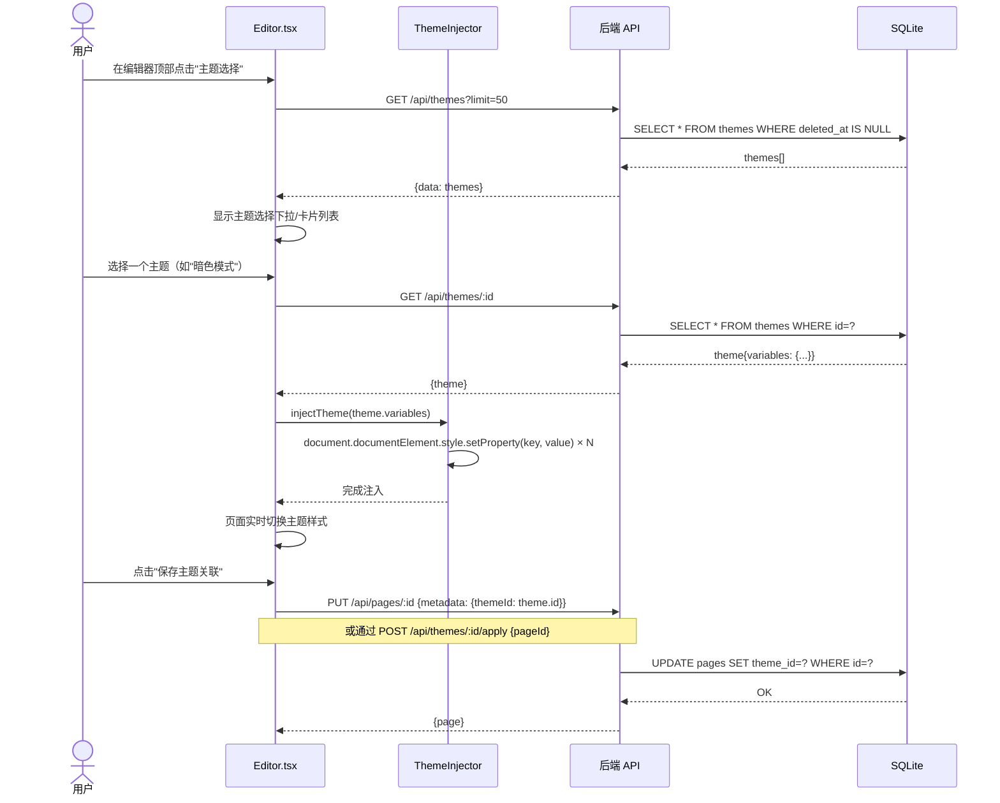
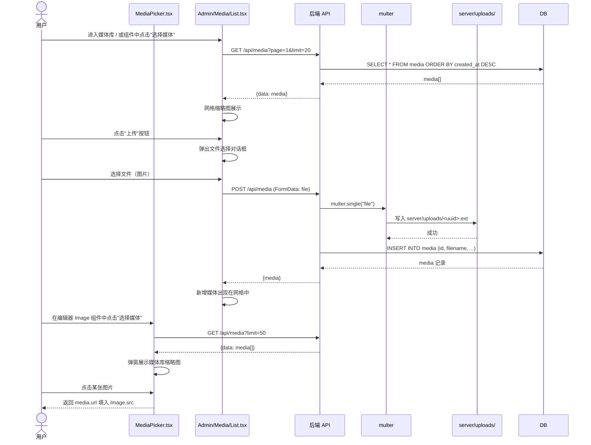
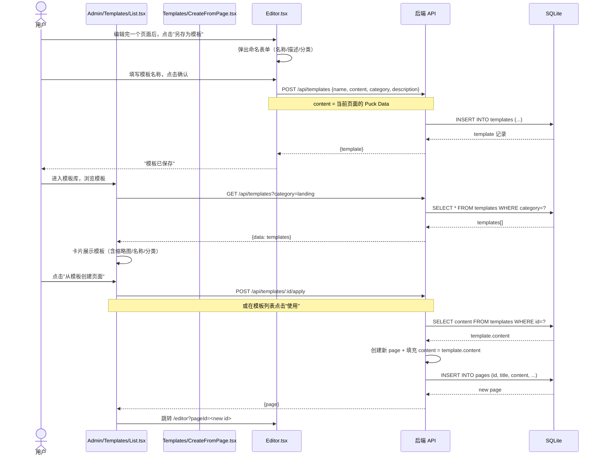
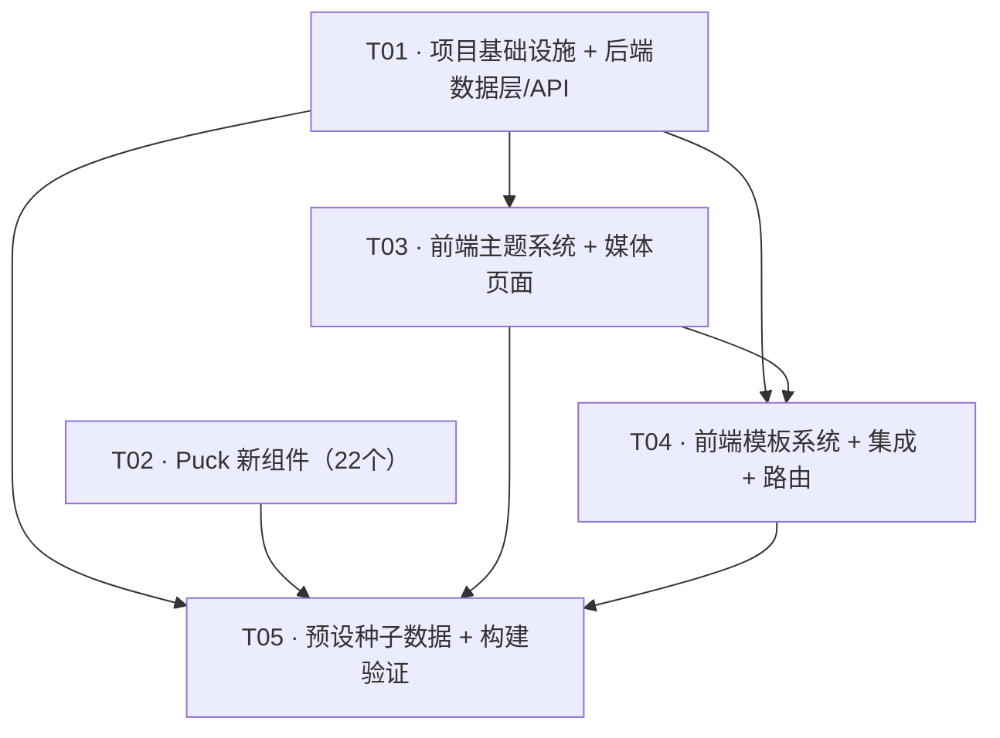

# 二期「功能完善」增量架构设计 + 任务分解

> 角色：架构师（高见远 / Bob）
> 范围：在一期「核心引擎」（Puck 编辑器 + 8 基础组件 + 管理后台 + SQLite 持久化）基础上，增量实现计划书第 3 章 P0/P1 全量功能：
> - **A.** 布局/展示/表单/高级组件（共计 ~18 个新 Puck 组件）
> - **B.** 主题系统（CSS 变量注入 + 数据模型 + API + 管理页面）
> - **C.** 媒体管理（文件上传 + 数据模型 + API + 管理页面 + 组件内选媒体）
> - **D.** 模板系统（种子数据 + API + 管理页面 + 从页面存为模板）

---

## 1. 增量实现方案

### 1.1 前端框架选型（沿袭一期，不引入新框架）

| 原有依赖 | 二期变更 |
|---------|---------|
| React 19 + Vite 6 + TS 5 | 不变 |
| Tailwind v4 + shadcn/ui | 不变 |
| @measured/puck ^0.20.1 | 不变。新组件均导出标准 `ComponentConfig` |
| React Router 7 | 不变。新增路由 `/admin/themes/*`、`/admin/media/*`、`/admin/templates/*` |
| multer（新增） | 文件上传中间件 |
| crypto.randomUUID（已有） | 媒体表 ID 生成复用同一机制 |

### 1.2 主题系统实现方案：CSS 变量注入

```
核心思路：主题本质是一组 CSS 变量值（颜色/字体/间距/圆角/阴影/过渡）。
编辑器/预览页在顶层组件通过 useEffect 注入：
  document.documentElement.style.setProperty("--primary", theme.variables.primary)
```

- **存储**：`themes` 表的 `variables` 列为 JSON，存储完整 CSS 变量集合
- **注入时机**：编辑器（Editor.tsx）读取当前页面的 `theme_id` → 加载主题 → 注入 CSS 变量
- **应用范围**：全局 `:root` 级别，Tailwind CSS 变量覆盖至 `tailwind.config` 对应 token
- **预设主题**：5 个预设主题作为种子 JSON 数据，启动时通过导入 API 写入
- **无主题时**：使用 Tailwind 默认变量（不变，透明降级）

**ThemeVariables 结构**（与计划书 4.1 对齐）：
```typescript
interface ThemeVariables {
  // 颜色
  "--primary": string        // #3b82f6
  "--primary-foreground": string
  "--secondary": string
  "--secondary-foreground": string
  "--background": string
  "--foreground": string
  "--muted": string
  "--muted-foreground": string
  "--accent": string
  "--accent-foreground": string
  "--destructive": string
  "--destructive-foreground": string
  "--border": string
  "--input": string
  "--ring": string
  // 字体
  "--font-sans": string       // "Inter, sans-serif"
  "--font-mono": string       // "JetBrains Mono, monospace"
  // 间距
  "--spacing-unit": string    // "4px"
  // 圆角
  "--radius": string          // "8px"
  // 阴影
  "--shadow-sm": string
  "--shadow-md": string
  "--shadow-lg": string
  // 过渡
  "--transition": string      // "150ms ease"
}
```

**与 Tailwind v4 的对接方式**：
Tailwind v4 已原生支持 CSS 变量驱动的主题。`@tailwindcss/vite` 插件自动识别 Tailwind 预设 token。我们通过注入 `:root` 级别的 CSS 变量来覆盖这些 token，无需修改 Tailwind 配置。

### 1.3 媒体管理实现方案：multer + 文件系统存储

```
核心思路：使用 multer 处理 multipart/form-data 上传，文件存储到 server/uploads/。
Express 以静态文件中间件提供 /uploads 路径访问。
```

- **上传流程**：前端 `<input type="file">` / 拖拽 → `FormData` → `POST /api/media`（multer 中间件）→ 写入 `server/uploads/` → 写入 `media` 表元数据 → 返回媒体对象
- **文件命名**：`crypto.randomUUID() + path.extname(originalname)`，避免重名和路径穿越
- **存储路径**：`server/uploads/`（.gitignore 添加 `server/uploads/`）
- **访问 URL**：`/uploads/<uuid>.ext`，由 Express `express.static` 提供
- **图片尺寸**：multer 不处理图片缩放，只记录 `file.size`；宽度/高度由前端（FileReader + Image）读取后上传
- **安全性**：严格限制 MIME 类型为图片常见类型 + 文件大小上限 10MB；文件名用 UUID 重写防路径穿越

### 1.4 模板系统实现方案：JSON 种子数据

```
核心思路：模板 = 保存的 Puck Data 快照，与页面解耦。
预设模板为 JSON 文件（Puck Data 格式），预置到 server/data/presets/ 目录。
```

- **预设模板**：5+ 个 JSON 文件放在 `server/data/presets/`，数据结构与 `templates.content` 一致
- **"保存页面为模板"**：将已有页面的 `content`（Puck Data）复制为新模板记录
- **"从模板创建页面"**：读取模板的 `content`，作为新建页面的初始内容
- **模板分类**：`category` 字段标识用途（"landing" / "about" / "contact" / "blog" / "gallery"）
- **无模板时**：页面创建仍使用 `emptyData` 兜底

### 1.5 一期 `pages` 表增量修改

新增列（ALTER TABLE，幂等逻辑写在 `db.js` 中通过 `PRAGMA table_info` 判断）：

| 列名 | 类型 | 默认值 | 说明 |
|------|------|--------|------|
| `theme_id` | TEXT | NULL | 关联 themes.id，可选 |

### 1.6 组件实现说明

所有新 Puck 组件遵循一期既有的 `ComponentConfig` 模式（`fields` + `defaultProps` + `render`）：

- **布局组件**（Container/Row/Column/Grid/Card/Section/Tabs）：Container 使用 Puck 的 `DropZone` 实现可嵌套；Row/Column 用 Flexbox；Grid 用 CSS Grid；Card/Section 为语义容器；Tabs 用状态切换子内容
- **展示组件**（Accordion/Carousel/Table/List/Progress/Video）：纯 UI 渲染，无外部依赖。Carousel 用 CSS scroll-snap；Table 用 HTML `<table>`；Progress 用 CSS `width` 百分比
- **表单组件**（Form/FormInput/FormSelect/FormCheckbox/FormSwitch）：Form 为容器，内嵌表单字段；各字段组件与 `render` 输出受控表单元素
- **高级组件**（Modal/Drawer/Dropdown/RichText/Upload）：Modal/Drawer 用 CSS `position: fixed` + 状态切换；RichText 用 `contentEditable`；Upload 调用媒体 API

> ⚠️ **Puck 组件中调用外部 API**：Upload 组件在 `render` 中调用 `POST /api/media` 上传文件。由于 Puck render 是纯客户端渲染，需要从 `window.fetch` 直接调用（不经过 React Router 代理约束）。

---

## 2. 文件清单（按模块分组）

### A. 布局/展示/表单/高级组件（新增 22 个文件，修改 2 个）

#### 布局组件 — `src/puck/components/layout/`

| 文件 | 职责 |
|------|------|
| `src/puck/components/layout/Container.tsx` | 容器组件，可嵌套 DropZone（children 区域） |
| `src/puck/components/layout/Row.tsx` | 行（Flex row，可配置水平/垂直对齐） |
| `src/puck/components/layout/Column.tsx` | 列（Flex column，可配置宽度占比） |
| `src/puck/components/layout/Grid.tsx` | 网格（CSS Grid，可配置列数/间距） |
| `src/puck/components/layout/Card.tsx` | 卡片容器（含标题/内容插槽） |
| `src/puck/components/layout/Section.tsx` | 节容器（含背景色/内边距/圆角） |
| `src/puck/components/layout/Tabs.tsx` | 标签页（可配置多个 tab 标签及对应内容） |

#### 展示组件 — `src/puck/components/display/`

| 文件 | 职责 |
|------|------|
| `src/puck/components/display/Accordion.tsx` | 手风琴（多个可展开项） |
| `src/puck/components/display/Carousel.tsx` | 轮播（图片/内容轮播，用 CSS scroll-snap） |
| `src/puck/components/display/Table.tsx` | 表格（可配置表头/行数据） |
| `src/puck/components/display/List.tsx` | 列表（有序/无序，带可配置项） |
| `src/puck/components/display/Progress.tsx` | 进度条（百分比） |
| `src/puck/components/display/Video.tsx` | 视频（URL/嵌入） |

#### 表单组件 — `src/puck/components/form/`

| 文件 | 职责 |
|------|------|
| `src/puck/components/form/Form.tsx` | 表单容器（包裹子字段，含提交 URL/方法配置） |
| `src/puck/components/form/FormInput.tsx` | 表单输入框（label/placeholder/必填） |
| `src/puck/components/form/FormSelect.tsx` | 下拉选择（多选项配置） |
| `src/puck/components/form/FormCheckbox.tsx` | 复选框（label/默认选中） |
| `src/puck/components/form/FormSwitch.tsx` | 开关（label/默认状态） |

#### 高级组件 — `src/puck/components/advanced/`

| 文件 | 职责 |
|------|------|
| `src/puck/components/advanced/Modal.tsx` | 模态框（触发按钮 + 弹窗内容） |
| `src/puck/components/advanced/Drawer.tsx` | 抽屉（侧滑面板） |
| `src/puck/components/advanced/Dropdown.tsx` | 下拉菜单（触发按钮 + 菜单项） |
| `src/puck/components/advanced/RichText.tsx` | 富文本（contentEditable + 简单格式化工具栏） |
| `src/puck/components/advanced/Upload.tsx` | 上传（调用媒体 API，可配置多重/单文件） |

#### 配置文件（修改）

| 文件 | 职责 |
|------|------|
| `src/puck/config.tsx`（改） | 聚合全部新组件（layout/display/form/advanced 四组） |
| `src/puck/theme/`（新目录） | 主题相关类型与预设 |

### B. 主题系统（新增 ~8 个文件，修改 4 个）

#### 后端

| 文件 | 职责 |
|------|------|
| `server/repositories/themeRepository.js`（新） | themes 表 CRUD：list/get/create/update/delete/apply |
| `server/routes/themes.js`（新） | 主题 API 路由：列表/创建/详情/更新/删除/导入/导出/应用到页面 |
| `server/db.js`（改） | 新增 themes 表建表 + pages 表新增 theme_id 列（幂等） |

#### 前端类型与预设

| 文件 | 职责 |
|------|------|
| `src/types/theme.ts`（新） | Theme / ThemeVariables 类型定义 |
| `src/puck/theme/presets.ts`（新） | 5 个预设主题数据（CSS 变量对象） |
| `src/puck/theme/ThemeInjector.tsx`（新） | 主题注入组件（useEffect 写 CSS 变量到 :root） |
| `src/lib/api.themes.ts`（新） | 主题 API 封装 |

#### 管理页面

| 文件 | 职责 |
|------|------|
| `src/pages/admin/Themes/List.tsx`（新） | 主题列表（表格 + 预览缩略图 + 预设标记） |
| `src/pages/admin/Themes/CreateEdit.tsx`（新） | 主题创建/编辑表单（含变量编辑） |
| `src/pages/admin/Themes/ImportTheme.tsx`（新） | 导入 JSON 主题 |

#### 修改的页面

| 文件 | 职责 |
|------|------|
| `src/pages/Editor.tsx`（改） | 集成主题选择器（切换主题时注入 CSS 变量） |
| `src/pages/Preview.tsx`（改） | 集成主题注入（预览时读取并应用主题） |

### C. 媒体管理（新增 ~7 个文件，修改 2 个）

#### 后端

| 文件 | 职责 |
|------|------|
| `server/repositories/mediaRepository.js`（新） | media 表 CRUD：list/get/create/update/delete/batchCreate |
| `server/routes/media.js`（新） | 媒体 API 路由 + multer 中间件配置 |
| `server/db.js`（改） | 新增 media 表建表 |
| `server/index.js`（改） | 挂载 media 路由 + express.static('uploads') |
| `server/uploads/`（新目录） | 上传文件存储（.gitignore） |

#### 前端

| 文件 | 职责 |
|------|------|
| `src/types/media.ts`（新） | Media 类型定义 |
| `src/lib/api.media.ts`（新） | 媒体 API 封装 |
| `src/pages/admin/Media/List.tsx`（新） | 媒体库列表（网格/列表视图 + 搜索 + 分页） |
| `src/pages/admin/Media/MediaPicker.tsx`（新） | 媒体选择器弹窗（在 Puck 组件配置中选择媒体） |

### D. 模板系统（新增 ~7 个文件）

#### 后端

| 文件 | 职责 |
|------|------|
| `server/repositories/templateRepository.js`（新） | templates 表 CRUD：list/get/create/delete/apply |
| `server/routes/templates.js`（新） | 模板 API 路由 |
| `server/db.js`（改） | 新增 templates 表建表 |
| `server/data/presets/`（新目录） | 预设模板 JSON 种子文件（5+ 个） |

#### 前端

| 文件 | 职责 |
|------|------|
| `src/types/template.ts`（新） | Template 类型定义 |
| `src/lib/api.templates.ts`（新） | 模板 API 封装 |
| `src/pages/admin/Templates/List.tsx`（新） | 模板列表（卡片视图 + 分类筛选） |
| `src/pages/admin/Templates/CreateFromPage.tsx`（新） | 从当前页面保存为模板 |

### 路由与导航整合

| 文件 | 职责 |
|------|------|
| `src/App.tsx`（改） | 新增主题/媒体/模板管理路由 |
| `src/components/Navbar.tsx`（改） | 新增导航入口（主题/媒体/模板） |

---

## 3. 数据结构和接口

### 3.1 类图 — 新增模型与一期 Page 的关系

详见 `docs/class-diagram-v2.mermaid`。核心关系：

- **Theme** ↔ **Page**：多对一（一个页面可关联一个主题，一个主题可被多个页面使用）。`Page.themeId → Theme.id`
- **Media**：独立资源，不与 Page 强关联。Upload 组件在 Puck 内容中以 `mediaId` 引用
- **Template**：独立资源。`Template.content` 结构与 `Page.content` 一致（均为 Puck Data）。从模板创建页面即 `newPage.content = template.content`
- **PageVersion**：本版本暂不引入（留待三期版本历史）

### 3.2 新增 API 清单

#### B. 主题 API

| 方法 | 路径 | 请求 | 成功响应 | 说明 |
|------|------|------|----------|------|
| GET | `/api/themes` | Query: `page`, `limit`, `search` | `{data: Theme[], total, page, limit}` | 列表 |
| POST | `/api/themes` | Body: `{name, description, variables}` | `{theme}` | 创建 |
| GET | `/api/themes/:id` | — | `{theme}` | 详情 |
| PUT | `/api/themes/:id` | Body: `{name?, description?, variables?}` | `{theme}` | 更新 |
| DELETE | `/api/themes/:id` | — | `{ok: true}` | 删除（非预设可删） |
| POST | `/api/themes/import` | Body: `{name, description, variables}` | `{theme}` | 导入 JSON 主题 |
| GET | `/api/themes/:id/export` | — | `{variables}` | 导出主题配置（JSON） |
| POST | `/api/themes/:id/apply` | Body: `{pageId}` | `{ok: true}` | 应用到页面（设 page.theme_id = theme.id） |

#### C. 媒体 API

| 方法 | 路径 | 请求 | 成功响应 | 说明 |
|------|------|------|----------|------|
| GET | `/api/media` | Query: `page`, `limit`, `search`, `mimeType` | `{data: Media[], total, page, limit}` | 列表（分页/搜索/MIME 筛选） |
| POST | `/api/media` | FormData: `file`(multipart) + `alt?` + `tags?` | `{media}` | 上传单文件 |
| PUT | `/api/media/:id` | Body: `{alt?, tags?}` | `{media}` | 更新元数据 |
| DELETE | `/api/media/:id` | — | `{ok: true}` | 删除文件+记录 |
| POST | `/api/media/batch` | FormData: `files[]`(multipart) | `{media: Media[]}` | 批量上传 |

#### D. 模板 API

| 方法 | 路径 | 请求 | 成功响应 | 说明 |
|------|------|------|----------|------|
| GET | `/api/templates` | Query: `page`, `limit`, `category` | `{data: Template[], total, page, limit}` | 列表 |
| POST | `/api/templates` | Body: `{name, description, content, category}` | `{template}` | 创建（含"从页面保存"） |
| GET | `/api/templates/:id` | — | `{template}` | 详情 |
| DELETE | `/api/templates/:id` | — | `{ok: true}` | 删除 |
| POST | `/api/templates/:id/apply` | Body: `{pageId}` | `{page}` | 应用到页面（将 template.content 写入 page.content） |

> 错误响应统一复用一期格式：`{ error: string, message?: string }` + HTTP 状态（400/404/409/500）。

---

## 4. 程序调用流程

### 4.1 链路 A：编辑器中选择主题 → 实时切换 CSS 变量



### 4.2 链路 B：媒体上传 → 在 Puck 组件中选择媒体



### 4.3 链路 C：保存页面为模板 → 从模板创建页面



---

## 5. 新增/修改依赖包

```
multer@^2.0.0         // Express 文件上传中间件（运行依赖）
```

- `crypto.randomUUID` 已由 Node 22 内置，无需 `uuid` 包
- `better-sqlite3`、`cors`、`express` 等一期已安装
- 无新增前端依赖

安装命令：
```bash
npm install multer
```

---

## 6. 任务列表（有序，按依赖排列，最多 5 个任务）

### T01 · 项目基础设施 + 后端增量（数据层 + API）

| 字段 | 内容 |
|------|------|
| **Task ID** | T01 |
| **Task Name** | 项目基础设施 + 后端数据层与 API（主题/媒体/模板） |
| **Priority** | P0 |
| **Dependencies** | 无 |

**涉及文件（9 个）**：
| 文件 | 操作 |
|------|------|
| `package.json` | 改：添加 `multer` 依赖 |
| `server/db.js` | 改：新增 `themes`、`media`、`templates` 表建表 + `pages` 表 `theme_id` 列（幂等） |
| `server/repositories/themeRepository.js` | 新：themes 表 CRUD |
| `server/repositories/mediaRepository.js` | 新：media 表 CRUD |
| `server/repositories/templateRepository.js` | 新：templates 表 CRUD |
| `server/routes/themes.js` | 新：主题 API（8 个端点） |
| `server/routes/media.js` | 新：媒体 API（5 个端点 + multer 配置） |
| `server/routes/templates.js` | 新：模板 API（5 个端点） |
| `server/index.js` | 改：挂载 themes/media/templates 路由 + `express.static('uploads')` |

**验收点**：
- `npm run server` 启动后，`themes`、`media`、`templates` 三表自动建好
- `pages` 表增加 `theme_id` 列（NULL 兼容一期页面）
- 主题 CRUD API 可调通，导入/导出/应用到页面端点正常
- 媒体上传（POST /api/media 含 multer）成功后文件写入 `server/uploads/`，`media` 表返回正确记录
- 模板 API 列表/创建/详情/删除/应用到页面端点正常

### T02 · Puck 新组件（布局/展示/表单/高级 ~22 个）

| 字段 | 内容 |
|------|------|
| **Task ID** | T02 |
| **Task Name** | 二期全部 Puck 新组件（layout/display/form/advanced） |
| **Priority** | P0 |
| **Dependencies** | 无（与 T01 无前后依赖，可并行） |

**涉及文件（23 个）**：
| 文件 | 操作 |
|------|------|
| `src/puck/components/layout/Container.tsx` | 新 |
| `src/puck/components/layout/Row.tsx` | 新 |
| `src/puck/components/layout/Column.tsx` | 新 |
| `src/puck/components/layout/Grid.tsx` | 新 |
| `src/puck/components/layout/Card.tsx` | 新 |
| `src/puck/components/layout/Section.tsx` | 新 |
| `src/puck/components/layout/Tabs.tsx` | 新 |
| `src/puck/components/display/Accordion.tsx` | 新 |
| `src/puck/components/display/Carousel.tsx` | 新 |
| `src/puck/components/display/Table.tsx` | 新 |
| `src/puck/components/display/List.tsx` | 新 |
| `src/puck/components/display/Progress.tsx` | 新 |
| `src/puck/components/display/Video.tsx` | 新 |
| `src/puck/components/form/Form.tsx` | 新 |
| `src/puck/components/form/FormInput.tsx` | 新 |
| `src/puck/components/form/FormSelect.tsx` | 新 |
| `src/puck/components/form/FormCheckbox.tsx` | 新 |
| `src/puck/components/form/FormSwitch.tsx` | 新 |
| `src/puck/components/advanced/Modal.tsx` | 新 |
| `src/puck/components/advanced/Drawer.tsx` | 新 |
| `src/puck/components/advanced/Dropdown.tsx` | 新 |
| `src/puck/components/advanced/RichText.tsx` | 新 |
| `src/puck/components/advanced/Upload.tsx` | 新 |
| `src/puck/config.tsx` | 改：聚合全部新组件 |

**验收点**：
- 22 个组件各自导出合规的 `ComponentConfig`（fields + defaultProps + render）
- `config.tsx` 按 layout/display/form/advanced 分组聚合全部新组件
- Container 组件正确使用 Puck 的 `DropZone` 实现子组件嵌套
- `tsc -b` 通过（无类型错误）
- `npm run dev` 后在编辑器侧栏可见全部新组件

### T03 · 前端主题系统 + 媒体管理页面

| 字段 | 内容 |
|------|------|
| **Task ID** | T03 |
| **Task Name** | 前端主题系统 + 媒体管理页面 |
| **Priority** | P0 |
| **Dependencies** | T01 |

**涉及文件（10 个）**：
| 文件 | 操作 |
|------|------|
| `src/types/theme.ts` | 新：Theme / ThemeVariables 类型 |
| `src/puck/theme/presets.ts` | 新：5 个预设主题数据 |
| `src/puck/theme/ThemeInjector.tsx` | 新：CSS 变量注入组件 |
| `src/lib/api.themes.ts` | 新：主题 API 封装 |
| `src/pages/admin/Themes/List.tsx` | 新：主题列表页 |
| `src/pages/admin/Themes/CreateEdit.tsx` | 新：主题创建/编辑 |
| `src/pages/admin/Themes/ImportTheme.tsx` | 新：导入主题 |
| `src/types/media.ts` | 新：Media 类型 |
| `src/lib/api.media.ts` | 新：媒体 API 封装 |
| `src/pages/admin/Media/List.tsx` | 新：媒体库列表（网格 + 上传） |
| `src/pages/admin/Media/MediaPicker.tsx` | 新：媒体选择器弹窗 |

**验收点**：
- 主题列表可展示/创建/编辑/删除/导入主题
- `ThemeInjector` 可正确注入 CSS 变量到 `:root`（通过 DevTools 验证）
- 媒体库列表以网格展示已有媒体，支持上传、删除、搜索
- `MediaPicker` 弹窗可调用媒体列表并返回选中媒体的 URL

### T04 · 前端模板系统 + 编辑器/预览页主题集成 + 路由导航

| 字段 | 内容 |
|------|------|
| **Task ID** | T04 |
| **Task Name** | 前端模板系统 + 编辑器/预览主题集成 + 路由导航 |
| **Priority** | P0 |
| **Dependencies** | T01, T03 |

**涉及文件（10 个）**：
| 文件 | 操作 |
|------|------|
| `src/types/template.ts` | 新：Template 类型 |
| `src/lib/api.templates.ts` | 新：模板 API 封装 |
| `src/pages/admin/Templates/List.tsx` | 新：模板列表 |
| `src/pages/admin/Templates/CreateFromPage.tsx` | 新：从页面保存为模板 |
| `src/pages/Editor.tsx` | 改：集成主题选择器 + ThemeInjector |
| `src/pages/Preview.tsx` | 改：集成 ThemeInjector |
| `src/pages/admin/List.tsx` | 改：新增"另存为模板"按钮 |
| `src/App.tsx` | 改：新增路由 `/admin/themes/*`、`/admin/media/*`、`/admin/templates/*` |
| `src/components/Navbar.tsx` | 改：新增导航入口 |
| `src/lib/api.ts` | 改：新增 `updatePage` 支持 `themeId` 字段 |

**验收点**：
- 模板列表展示预设模板 + 用户保存的模板，支持分类筛选
- 编辑器页面可选择主题并实时切换样式（CSS 变量注入）
- 编辑器顶部有"另存为模板"按钮，可命名保存
- 从模板列表点击"使用"可创建新页面并跳转编辑器
- 预览页加载页面时同时加载并注入关联主题
- Navbar 新增"主题管理""媒体库""模板库"入口

### T05 · 预设种子数据 + 构建验证 + 回归测试

| 字段 | 内容 |
|------|------|
| **Task ID** | T05 |
| **Task Name** | 预设种子数据 + 构建验证 |
| **Priority** | P1 |
| **Dependencies** | T01, T02, T03, T04 |

**涉及文件（8+ 个）**：
| 文件 | 操作 |
|------|------|
| `server/data/presets/landing.json` | 新：落地页模板 |
| `server/data/presets/about.json` | 新：关于页模板 |
| `server/data/presets/contact.json` | 新：联系页模板 |
| `server/data/presets/blog.json` | 新：博客模板 |
| `server/data/presets/gallery.json` | 新：画廊模板 |
| `server/data/presets/default-themes.json` | 新：5 个预设主题的 JSON 种子（浅色/深色/蓝色/绿色/暖色） |
| `server/db.js`（改） | 改：启动时检查并写入预设主题和模板 |

**验收点**：
- `npm run dev:all` 同时启动前后端
- `npm run build` 无 TS/Vite 错误
- 启动后自动写入 5 个预设主题 + 5 个预设模板
- 端到端走通全链路：
  1. 创建页面 → 编辑器添加 Container/Row/Column 布局组件
  2. 在编辑器中选择并切换主题 → 实时变化
  3. 上传图片 → 在 Image 组件中通过 MediaPicker 选择
  4. 另存为模板 → 模板列表可见
  5. 从模板创建新页面 → 内容正确
- 一期功能不受影响：原有页面列表/编辑器/预览正常

---

## 7. 共享知识（跨文件约定）

| 主题 | 约定 |
|------|------|
| **CSS 变量注入方式** | 统一通过 `ThemeInjector` 调用 `document.documentElement.style.setProperty(key, value)`。每个 key 对应一个 CSS 自定义属性名（如 `--primary`），value 为颜色值或字面值。编辑器/预览页在顶层 `useEffect` 中调用。无主题时使用 Tailwind 默认值。 |
| **上传文件存储路径** | `server/uploads/<uuid>.<ext>`。Express 以 `app.use('/uploads', express.static('server/uploads'))` 提供静态访问。`media.url` 存储相对路径 `/uploads/<uuid>.<ext>`。 |
| **Puck Data 与主题关联方式** | 主题通过 `pages.theme_id` 关联（非存在 `Page.content` 中）。页面加载时读取 `page.metadata.themeId` 或 `page.theme_id`。编辑器切换主题时同时更新页面元数据。预览时通过 GET 接口加载页面后，额外加载对应主题注入 CSS 变量。 |
| **预设主题/模板写入时机** | `server/db.js` 导出连接后，通过 `INSERT OR IGNORE` 写入预设数据（基于 `id` 或 `name` 唯一约束）。约定预设数据的 `id` 为固定 UUID 以便识别。 |
| **API 路径扩展** | 新增三条基路径：`/api/themes/*`、`/api/media/*`、`/api/templates/*`。所有新增 API 复用一期 `asyncHandler` 错误转发模式。响应信封遵循一期格式。 |
| **HTTP 文件上传约定** | 上传接口 `POST /api/media` 接收 `multipart/form-data`，字段名为 `file`（单文件）或 `files[]`（批量）。其他字段（`alt`、`tags`）为普通 form 字段。前端使用 `FormData` 构造请求，**不设置 `Content-Type`**（浏览器自动设置带 boundary）。 |
| **媒体 MIME 限制** | 仅允许 `image/jpeg`、`image/png`、`image/gif`、`image/webp`、`image/svg+xml`。单文件最大 10MB。超限或类型不匹配返回 400 + `{error: "invalid_file"}`。 |
| **Puck 组件内部调用 API** | 除 Upload 组件外，Puck 组件 `render` 中无需调用外部 API。Upload 组件通过 `window.fetch` 直接调用 `/api/media`（不通过 React 封装层）。 |
| **类型新增** | `src/types/` 下新增 `theme.ts`、`media.ts`、`template.ts`。API 封装对应 `src/lib/api.themes.ts`、`src/lib/api.media.ts`、`src/lib/api.templates.ts`（按模块拆分而非全部塞入 `api.ts`，避免单文件膨胀）。 |
| **预设数据不可删除** | `themes.is_preset = 1` 或 `templates.is_preset = 1` 的记录，DELETE 接口返回 400 `{error: "cannot_delete_preset"}`。 |
| **Field 命名惯例** | 新增 Puck 组件的 `fields` 配置中，支持媒体选择的字段类型统一用 `{ type: "custom", render: ... }` 嵌入 `MediaPicker` 按钮。 |

---

## 8. 待明确事项

1. **媒体文件删除时是否物理删除文件？** — 当前设计是硬删除（DELETE 时同时删除文件记录和物理文件）。如果后续需要"回收站"方式恢复，则改为软删除。二期默认硬删除，若需调整在二期测试阶段确认。

2. **主题作用域** — 当前设计主题仅影响前端展示（CSS 变量覆盖 Tailwind tokens）。是否需要在编辑器中也应用主题（即编辑时所见即所得的主题样式）？二期默认编辑器和预览页均应用主题。若仅预览时应用主题，需减少 Editor.tsx 中的主题注入逻辑。

3. **模板缩略图** — 预设模板的 `thumbnail` 列约定为 URL 或相对路径。二期预设模板可能无实际缩略图图片，使用占位图或"从页面内容自动生成"待定。建议二期先使用占位图（`/placeholder-thumb.svg`）。

4. **Upload 组件的文件选择方式** — 组件渲染时为静态预览，实际文件选择/上传通过 Puck 字段配置中的自定义字段触发（类似 `MediaPicker` 弹窗）。Upload 组件的 `render` 输出当前已选文件的预览，上传操作通过自定义 `field` 的 `render` 实现。需要在组件 spec 中明确。

5. **Tabs 组件的子内容管理** — Puck 原生 `DropZone` 不支持动态数量的子区域。Tabs 组件可通过在 `fields` 中配置多个 tab 标签字符串数组，每个 tab 的内容使用单个 `DropZone`（切换时显示对应内容）或通过 `ArrayField` 实现。二期采用单 `DropZone` + 标签切换方式。

6. **一期数据兼容性** — 已有 `pages` 表记录无 `theme_id` 列。ALTER TABLE 后旧记录的 `theme_id` 为 NULL，代码需做 null 安全处理。

7. **预设模板的 seed 时机** — 预设数据在 `server/db.js` 连接初始化后写入。需考虑幂等性（`INSERT OR IGNORE`）及在测试环境是否跳过（可通过环境变量 `SKIP_SEED` 控制）。

---

## 9. 任务依赖图

详见 `docs/task-graph-v2.mermaid`。



**说明**：T02（Puck 新组件）与 T01 无数据依赖，可并行开发。T03（主题+媒体前端）依赖 T01 的后端 API。T04（模板前端+集成）依赖 T01 和 T03。T05（种子数据+验证）依赖所有前置任务。

---

## 10. 最关键的 2 个技术风险与应对

### 风险 1：Puck 新组件与 DropZone 嵌套的兼容性风险

**风险描述**：二期的 Container/Card/Tabs 等布局组件需要嵌套 Puck 的 `DropZone` 实现子组件拖入。Puck 0.20.1 的 `DropZone` 在动态数量的嵌套场景下可能存在渲染性能问题或拖拽定位不准确。此外 Tabs 组件中 DropZone 与 tab 切换状态的绑定需要精细控制，容易出现内容渲染不一致。

**应对方案**：
1. **容器组件先做原型验证**：先实现 Container + DropZone 最小原型，确认嵌套渲染和拖拽正常后再铺开到所有布局组件
2. **Tabs 采用单 DropZone 方案**：不追求每个 tab 独立 DropZone（Puck 当前版本不支持动态多 DropZone），改为一个 DropZone + tab 标签切换显示/隐藏对应子元素
3. **兜底方案**：如果 Puck DropZone 嵌套出现严重问题，布局组件降级为纯 CSS 容器（无子 DropZone），子组件由用户手动拖入，通过外层容器的 CSS 控制布局

### 风险 2：CSS 变量注入与 Tailwind v4 的变量覆盖冲突

**风险描述**：Tailwind v4 的 `@tailwindcss/vite` 插件在构建时会锁定 CSS 变量的 token 值。如果主题系统在运行时通过 `document.documentElement.style.setProperty` 注入变量，但 Tailwind 的编译产物中某些 token 已被内联为具体值（而非引用 CSS 变量），则主题切换无法生效，出现"切换主题后颜色不变"的问题。

**应对方案**：
1. **验证 Tailwind v4 变量模式**：先在现有代码中验证 `bg-primary` 是否引用 `var(--primary)` 而非内联值。检查 `src/index.css` 中 `@import "tailwindcss"` 后的变量声明方式
2. **强制使用 `var()` 引用**：如果 Tailwind v4 默认内联了颜色值，通过在 `index.css` 中显式声明 CSS 变量覆盖层：
   ```css
   :root {
     --primary: #3b82f6; /* fallback */
   }
   ```
3. **最终兜底**：放弃 Tailwind 变量覆盖，改用 CSS 类名切换（在 ThemeInjector 中给 `<body>` 添加 `.theme-<id>` 类，预生成各主题的 CSS 类集合）。此方案工作量较大但是 100% 可靠，仅在 Tailwind v4 变量机制不符预期时启用。
