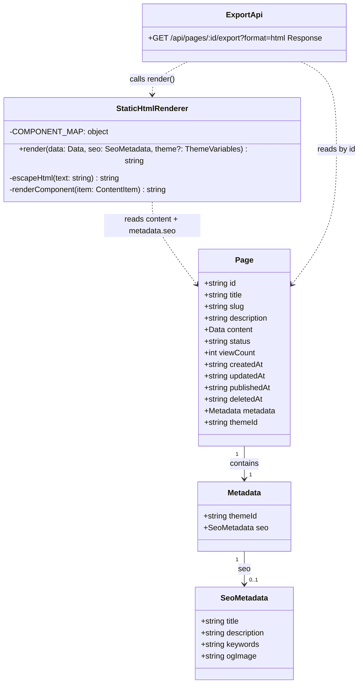
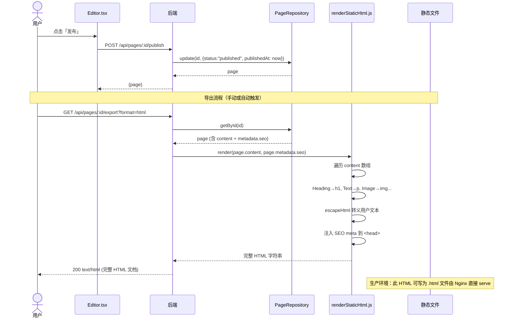
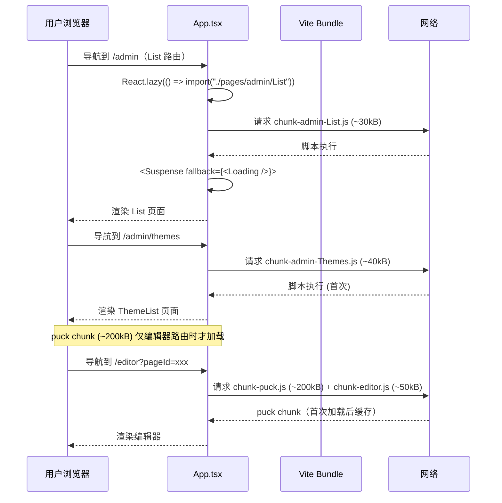
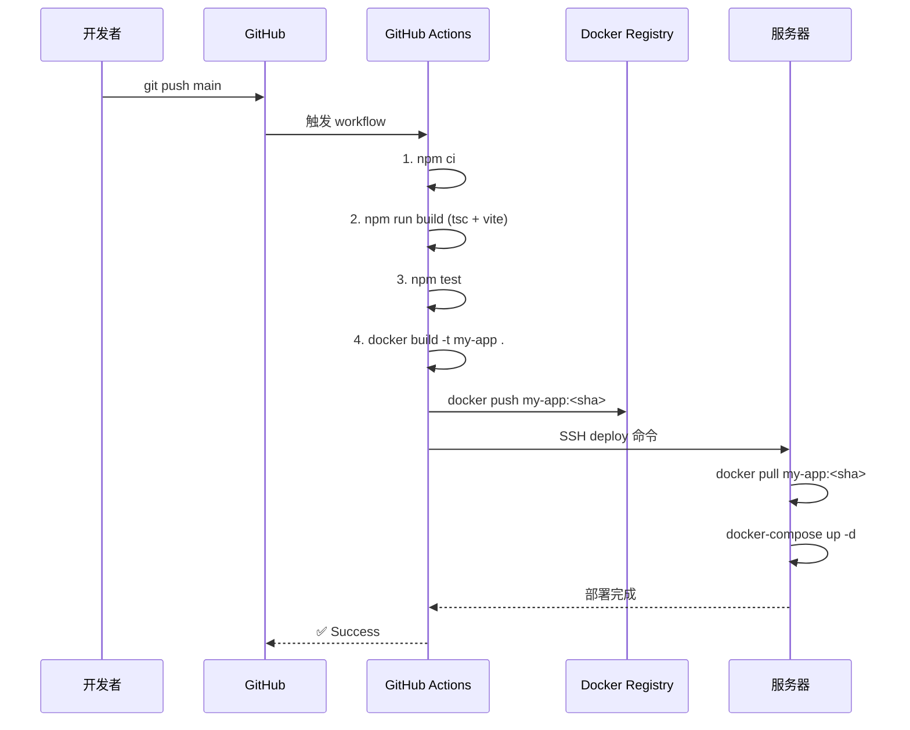
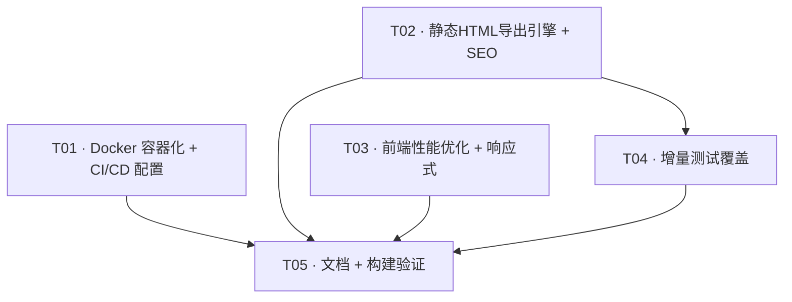

# 三期/四期「发布部署 + 优化交付」增量架构设计 + 任务分解

> 角色：架构师（高见远 / Bob）
> 范围：在一期「核心引擎」+ 二期「功能完善」（Puck 编辑器 + 30 组件 + 主题/媒体/模板系统 + SQLite 持久化）基础上，增量实现：
> - **三期 A.** 页面静态导出（生成静态 HTML）**B.** SEO 优化 **C.** Docker 容器化 **D.** CI/CD 流水线
> - **四期 E.** 性能优化 **F.** 响应式适配 **G.** 增量测试覆盖 **H.** 文档

---

## 1. 增量实现方案（A–H 每项选型与实现方式）

### A. 页面静态导出（生成静态 HTML）

**选型理由**：计划书建议用无头浏览器（Puppeteer）或 React `renderToString`，但二者均有明显弊端：
| 方案 | 弊端 |
|------|------|
| Puppeteer | 安装体积 ~300MB + Chromium ~300MB；CI/CD 构建慢；内存开销大 |
| `renderToString` | 依赖 React 运行时，需额外构建后端 Bundle（`tsx` → 服务端渲染）；增加维护复杂度和构建链 |

**选定方案：轻量 HTML 模板引擎（纯 JS 字符串拼接）**

实现方式：
1. 定义 `server/utils/renderStaticHtml.js` —— 一个纯函数，接收 `Puck Data`（`{ root, content }`）和 `seoMeta` 对象，返回完整 HTML 字符串
2. 维护一个 `server/templates/page.html` —— 模板骨架（`<!DOCTYPE html>` → `<head>` 含 `{{SEO_META}}` → `<body>` 含 `{{BODY_HTML}}`）
3. `renderStaticHtml.js` 的核心是一个组件 → HTML 标签的映射表：

```javascript
const COMPONENT_MAP = {
  Heading: (props) => `<${props.level} class="${props.align ? `text-${props.align}` : ''}">${escape(props.text)}</${props.level}>`,
  Text:    (props) => `<p>${escape(props.text)}</p>`,
  Image:   (props) => ``,
  Button:  (props) => `<a href="${escape(props.href || '#')}" class="btn btn-${props.variant || 'primary'}">${escape(props.label)}</a>`,
  Divider: (_)     => `<hr />`,
  // ... 30 个组件各有映射
}
```

4. `GET /api/pages/:id/export?format=html` 端点读取 `page.content` → 调用 `renderStaticHtml(page.content, page.metadata.seo)` → 返回 `Content-Type: text/html` 的响应
5. 安全性：所有用户文本经过 `escapeHtml` 转义（`&<>"'`）；属性值用双引号包裹

**覆盖范围**：全部 30 个 Puck 组件均有映射条目。布局组件（Container/Row/Column/Grid/Section/Card）递归渲染子内容。交互组件（Modal/Drawer/Dropdown/Tabs/Accordion/Carousel）导出为静态结构（不含 JS 交互）。表单组件导出为纯静态表单标记。

**不覆盖**：Upload 组件（无意义）、RichText 组件（`contentEditable` 内容作为 HTML 源码直接注入）。

### B. SEO 优化

**选型理由**：Page 模型的 `metadata` 字段一期/二期存为 `{}` 或 `{ themeId }`，三期扩展其结构最合理，无需改表结构（`metadata` 已是 TEXT JSON）。

**实现方式**：
1. 扩展 `metadata` 中的 `seo` 子对象：
```typescript
interface SeoMetadata {
  title?: string       // <title> 标签（缺省则 fallback 到 page.title）
  description?: string // <meta name="description">
  keywords?: string    // <meta name="keywords">
  ogImage?: string     // <meta property="og:image">
}
```
2. 编辑器页（Editor.tsx）增加一个可折叠的 "SEO 设置" 面板，包含四个输入字段
3. 管理后台创建/编辑页增加简化的 SEO 字段
4. 静态 HTML 导出时将 SEO 字段写入 `<head>`：
   - `<title>` → `seo.title || page.title`
   - `<meta name="description">` → `seo.description`
   - `<meta name="keywords">` → `seo.keywords`
   - `<meta property="og:image">` → `seo.ogImage`
   - `<meta property="og:title">` → 同 `title`
   - `<meta property="og:description">` → 同 `description`

### C. Docker 容器化

**选型理由**：多阶段构建实现最小生产镜像（~120MB vs 含 devDeps 的 ~1.2GB）。Nginx 作为静态文件服务器 + 反向代理，性能优于 Node 直接 serve 静态。

**实现架构**：
```
                  ┌──────────────┐
                  │   Nginx:80   │  ← 前置代理
                  │  (nginx/)    │
                  └──────┬───────┘
                         │
            ┌────────────┴────────────┐
            │                         │
    ┌───────▼───────┐       ┌─────────▼──────┐
    │  app:3001     │       │  redis:6379    │
    │  (Express)    │       │  (占位)        │
    │  + 静态文件    │       │                │
    └───────────────┘       └────────────────┘
```

**关键配置**：
- **Dockerfile**：Stage 1 `node:22-alpine` install + build → Stage 2 `nginx:alpine` 仅复制 `dist/`、`server/`、`node_modules/（--prod）`、`nginx.conf`
- **nginx.conf**：`/api` proxy_pass 到 `localhost:3001`；`/uploads` 反向代理到 `app:3001`；`/assets` 强缓存（`max-age=1y`）；`/editor`、`/admin`、`/preview`、`/p/` 等 SPA 路由 fallback 到 `index.html`
- **docker-compose.yml**：三个 service（app/redis/nginx），`depends_on` 确保启动顺序
- **.env.example**：`PORT=3001`、`NODE_ENV=production`、`DB_PATH=/data/app.db`

### D. CI/CD 流水线

**选型理由**：GitHub Actions 零额外成本，与项目仓库天然集成。

**流水线阶段**：
1. `push` 到 `main`/`master` 触发
2. **Test**：`npm ci` → `npm run build`（TypeScript 检查） → `npm test`（集成测试）
3. **Docker**：`docker build` → `docker tag/push` 到 Docker Hub / 私有 registry（镜像 tag = `git-sha` + `latest`）
4. **Deploy**：通过 SSH 登录目标服务器 → `docker pull` → `docker-compose up -d` 滚动更新

### E. 性能优化

**选型理由**：
1. **路由懒加载**：`React.lazy` + `Suspense` 是 React 内置的代码分割方案，零额外依赖。二期新增的 Themes/Media/Templates 等管理页面按路由分包，减少首屏 JS 体积
2. **manualChunks**：`@measured/puck` 约 556kB > 500kB，按 Vite 推荐用 `manualChunks` 拆出 `vendor`（React/ReactDOM/Router）与 `puck` 分离
3. **React.memo**：`Editor.tsx` 的顶部工具栏组件在每次 `onChange` 时都会重渲染，用 `React.memo(EditorToolbar)` 避免不必要重渲染。`Preview.tsx` 类似
4. **Loading/Skeleton**：统一 `src/components/Loading.tsx` 提供三种模式（`spinner`/`skeleton`/`text`），所有 async 操作的 UI 通过 `<Loading mode="skeleton" />` 占位

**预期收益**：
| 指标 | 优化前 | 优化后 |
|------|--------|--------|
| 首屏 JS 体积 | ~900kB | ~350kB（vendor ~200kB + puck ~200kB 按需加载） |
| 管理后台路由 JS | 全量加载 | 按需加载，每路由 ~20-50kB |
| 编辑器不必要的重渲染 | 每次 onChange 全组件树重渲染 | 仅变化部分重渲染 |

### F. 响应式适配

**选型理由**：Tailwind v4 的响应式前缀（`sm:`/`md:`/`lg:`）已就绪，需要做的是：
1. 编辑器顶部栏的「设备切换」按钮——设置 `max-width` 和缩放模拟
2. 组件使用检查——确保所有 Puck 组件的 `render` 函数中使用了响应式类而非固定宽度

**实现方式**：
1. Editor.tsx 增加三个设备模式按钮：Desktop（`max-w-none`）/ Tablet（`max-w-768px`）/ Mobile（`max-w-375px`）
2. 将编辑器的 `<Puck>` 包裹在 `<div>` 中，根据当前设备模式动态设置 `max-width` + `mx-auto`
3. 组件 checklist：在 T05 构建验证中逐组件检查并修复

### G. 测试覆盖（增量）

**选型理由**：延续一期 `node:test` + `node:assert` 风格，零额外依赖。二期新增的主题/媒体/模板 API 需补充测试。

**新增测试范围**：
| 测试组 | 测试点 |
|--------|--------|
| 媒体 API | 上传单文件（201）、批量上传（201）、列表（200 + 分页）、删除（200）、上传非法 MIME（400） |
| 主题 API | CRUD（创建/详情/更新/删除）、导入（200）、导出（200）、应用到页面（200）、删除预设主题（400） |
| 模板 API | CRUD、应用到页面（200 + page.content 被覆盖） |
| 静态导出 | export HTML 含 doctype、SEO meta tag、组件内容正确渲染、特殊字符转义 |

### H. 文档

README.md 内容结构：
```
# my-app — 可视化页面构建器
## 技术栈
## 快速开始（dev:all）
## 目录结构
## 如何贡献
```

docs/deployment.md 内容结构：
```
# 部署指南
## 方式一：Docker（推荐）
## 方式二：手动部署
## 环境变量说明
## Nginx 配置说明
```

docs/user-manual.md 内容结构：
```
# 用户手册
## 编辑器使用
## 组件说明（基础/布局/展示/表单/高级）
## 主题管理
## 媒体管理
## 模板管理
## 发布与 SEO
```

---

## 2. 文件清单（按 A–H 分组）

### A. 页面静态导出

| 文件 | 操作 | 职责 |
|------|------|------|
| `server/utils/renderStaticHtml.js` | **新** | 核心渲染函数：Puck Data → HTML 字符串。包含 30 组件映射表 + HTML 转义 + 递归渲染 |
| `server/templates/page.html` | **新** | HTML 模板骨架：`{{DOCTYPE}}<html><head>{{SEO_META}}<style>{{INLINE_CSS}}</style></head><body>{{BODY_HTML}}</body></html>` |
| `server/routes/pages.js` | **改** | `GET /api/pages/:id/export?format=html` 实现完整逻辑：读取 page → 调用 renderStaticHtml → 返回 text/html |

### B. SEO 优化

| 文件 | 操作 | 职责 |
|------|------|------|
| `src/types/page.ts` | **改** | Page 的 `metadata` 类型中增加 `SeoMetadata` 子接口 |
| `src/pages/Editor.tsx` | **改** | 增加可折叠「SEO 设置」面板（meta title/description/keywords/ogImage 输入） |
| `src/pages/admin/Create.tsx` | **改** | 创建/编辑页增加简化的 SEO 字段区域 |

### C. Docker 容器化

| 文件 | 操作 | 职责 |
|------|------|------|
| `Dockerfile` | **新** | 多阶段构建：node:22-alpine（install+build）→ nginx:alpine（serve） |
| `docker-compose.yml` | **新** | 三个 service：app（后端+前端静态）、redis（占位）、nginx（前置代理） |
| `nginx/nginx.conf` | **新** | 反向代理 /api→app:3001，静态资源缓存，SPA fallback |
| `.env.example` | **新** | 环境变量模板 |
| `.dockerignore` | **新** | 排除 node_modules、dist、server/data、server/uploads |

### D. CI/CD 流水线

| 文件 | 操作 | 职责 |
|------|------|------|
| `.github/workflows/deploy.yml` | **新** | GitHub Actions：push→test→build→docker build&push→SSH deploy |

### E. 性能优化

| 文件 | 操作 | 职责 |
|------|------|------|
| `src/App.tsx` | **改** | 6 个管理页面路由改为 `React.lazy()` + `<Suspense>` |
| `vite.config.ts` | **改** | `build.rollupOptions.output.manualChunks` 将 puck 和 vendor 分包 |
| `src/components/Loading.tsx` | **新** | 统一 Loading/Skeleton 组件（spinner / skeleton / text 三种模式） |
| `src/pages/Editor.tsx` | **改** | 顶部工具栏抽取为 `EditorToolbar`（`React.memo`） |
| `src/pages/Preview.tsx` | **改** | `React.memo` 包裹渲染区域 |

### F. 响应式适配

| 文件 | 操作 | 职责 |
|------|------|------|
| `src/pages/Editor.tsx` | **改** | 增加 desktop/tablet/mobile 切换按钮 + 画布宽度限制层 |

### G. 测试覆盖

| 文件 | 操作 | 职责 |
|------|------|------|
| `tests/api.integration.test.mjs` | **改** | 追加媒体/主题/模板 CRUD 测试 + 静态导出 HTML 测试 |
| `tests/media.test.mjs` | **新** | (可选) 媒体 API 专项测试文件 |
| `tests/export.test.mjs` | **新** | (可选) 静态导出专项测试文件 |

### H. 文档

| 文件 | 操作 | 职责 |
|------|------|------|
| `README.md` | **新** | 项目概述、技术栈、快速开始、目录结构 |
| `docs/deployment.md` | **新** | Docker + 手动部署指南 |
| `docs/user-manual.md` | **新** | 编辑器、组件、主题、媒体、模板完整用户手册 |

---

## 3. 数据结构和接口

### 3.1 类图 — 新增/修改的模型



### 3.2 新增/修改 API 清单

#### 修改：导出端点（占位 → 完整实现）

| 方法 | 路径 | Query | 成功响应 | 说明 |
|------|------|-------|----------|------|
| GET | `/api/pages/:id/export` | `format=html` | `Content-Type: text/html`，body 为完整 HTML 文档 | 若缺失 format 参数或 format != html，保持原有 JSON 响应 `{ page }` |
| | | 缺省 | `{ page }` | 向后兼容 |

---

## 4. 程序调用流程

### 4.1 链路 A：发布页面 → 静态 HTML 导出



### 4.2 链路 B：懒加载路由 + 分包加载



### 4.3 链路 C：Docker 构建部署



---

## 5. 待明确事项

1. **静态导出覆盖全部组件的程度**：30 个组件中有 5 个交互组件（Modal/Drawer/Dropdown/Tabs/Accordion/Carousel）导出为纯 HTML 静态结构，不含 JS 交互行为。用户手册中需明确标注"静态导出为纯 HTML，交互功能仅在编辑器/预览中生效"。

2. **Docker 在本机可验证性**：本机若未安装 Docker Desktop，三期 Docker 配置无法本地验证。建议 CI/CD 作为验证手段，或安装 Docker Desktop 后在本地 `docker compose up` 验证。

3. **GitHub Actions 实际运行**：需要项目上传到 GitHub 仓库后 workflow 才会触发。建议三期 D 项只在配置完成后做语法验证（`actionlint` 或 `yamllint`），实际运行依赖仓库迁移。

4. **测试文件的运行方式**：现有 `tests/api.integration.test.mjs` 需要后端运行在 `localhost:3001`。新增测试同样依赖后端实例。是否在 CI 中启动 server 再跑测试（npm run server & 后台运行 + 等待就绪）需确认。

5. **SEO 面板与现有编辑器 UI 的集成方式**：编辑器顶部栏已有标题/描述/主题选择/操作按钮。SEO 面板以「可折叠展开」形式放置，不增加顶栏高度。二期已有的 metadata 已存 `{ themeId }`，三期存储为 `{ themeId, seo: { title, description, keywords, ogImage } }`，确保向后兼容。

6. **生产模式下静态文件的提供方式**：Docker 方案中 Nginx 直接 serve `dist/` 中的前端构建产物。后端 `server/index.js` 不再提供前端静态文件（开发态由 Vite dev server 提供）。`dist/` 中的 `index.html` 需要正确引用分包后的 JS/CSS 资源。

7. **响应式切换的 UI 位置**：Editor 的顶部栏增加三个图标按钮（Desktop/Tablet/Mobile），切换后编辑器画布宽度受限并居中，Puck 的拖拽体验不变。

---

## 6. 任务列表（有序，最多 5 个任务）

### T01 · 项目基础设施 — Docker 容器化 + CI/CD 流水线配置

| 字段 | 内容 |
|------|------|
| **Task ID** | T01 |
| **Task Name** | 项目基础设施 — Docker 容器化 + CI/CD 流水线配置 |
| **Priority** | P0 |
| **Dependencies** | 无 |

**涉及文件（7 个）**：

| 文件 | 操作 | 说明 |
|------|------|------|
| `Dockerfile` | **新** | 多阶段构建：Stage1 node:22-alpine（install + build）→ Stage2 nginx:alpine（仅复制 dist/ + server/ + node_modules --prod + nginx.conf） |
| `docker-compose.yml` | **新** | app（image: my-app, ports: 3001:3001, volumes: db+uploads）、redis（image: redis:alpine, 占位）、nginx（image: nginx:alpine, ports: 80:80, volumes: nginx.conf） |
| `nginx/nginx.conf` | **新** | /api proxy_pass http://app:3001；/uploads 反向代理；/assets 强缓存 1y；SPA 路由（/editor /admin /preview）fallback 到 index.html；gzip on；安全头 |
| `.env.example` | **新** | PORT=3001, NODE_ENV=production, DB_PATH=/data/app.db |
| `.dockerignore` | **新** | 排除 node_modules、dist、server/data/、server/uploads/、.git、node_modules/.cache |
| `.github/workflows/deploy.yml` | **新** | push→main 触发：npm ci → npm run build → npm test → docker build → docker push → SSH deploy（docker pull + docker-compose up -d） |
| `package.json` | **改** | （可选）新增 `"docker:build": "docker build -t my-app ."` 脚本 |

**验收点**：
- `docker build -t my-app .` 成功构建，镜像大小 < 150MB
- `docker compose up` 后 `http://localhost:80` 可访问前端页面，`/api/hello` 返回正常
- `.env.example` 包含所有必需环境变量
- `deploy.yml` 通过 YAML 语法检查（可通过 `node -e "require('js-yaml').load(...)"` 或 CI 平台验证）
- SPA 路由（`/editor`, `/admin`, `/preview`）在 Nginx 下刷新不返回 404

---

### T02 · 静态 HTML 导出引擎 + SEO 元数据系统

| 字段 | 内容 |
|------|------|
| **Task ID** | T02 |
| **Task Name** | 静态 HTML 导出引擎 + SEO 元数据系统 |
| **Priority** | P0 |
| **Dependencies** | 无（与 T01 无代码依赖，可并行） |

**涉及文件（7 个）**：

| 文件 | 操作 | 说明 |
|------|------|------|
| `server/utils/renderStaticHtml.js` | **新** | 核心渲染函数：30 组件 → HTML 标签映射表 + 递归渲染 + HTML 转义。导出 `renderStaticHtml(data, seoMeta, themeCss?)` |
| `server/templates/page.html` | **新** | HTML 骨架模板：`<!DOCTYPE html><html><head>{{SEO_META}}<style>{{INLINE_CSS}}</style></head><body>{{BODY_HTML}}</body></html>` |
| `server/routes/pages.js` | **改** | 修改 `GET /api/pages/:id/export`：当 `?format=html` 时返回 `Content-Type: text/html` 的完整 HTML；缺省 format 时保持原有 JSON `{ page }` 响应 |
| `src/types/page.ts` | **改** | 新增 `SeoMetadata` 接口；`Metadata` 增加 `seo?: SeoMetadata`；更新 `UpdatePageInput` 的 metadata 类型 |
| `src/pages/Editor.tsx` | **改** | 顶部栏增加可折叠「SEO 设置」面板（meta title / description / keywords / ogImage 四个输入框 + 保存按钮） |
| `src/pages/admin/Create.tsx` | **改** | 创建页增加简化的 SEO 区域（可选字段，折叠在"高级选项"中） |
| `server/repositories/pageRepository.js` | **改** | 无改动（metadata 以 JSON 文本存储，seo 子字段自动序列化/反序列化） |

**验收点**：
- `GET /api/pages/:id/export?format=html` 返回 `Content-Type: text/html` 的完整 HTML 文档
- HTML 含有正确的 `<!DOCTYPE html>`、`<html>`、`<head>`（含 SEO meta）、`<body>`（含渲染内容）
- 30 个 Puck 组件均有映射条目（检查 COMPONENT_MAP 的 key 覆盖 config.tsx 的所有组件）
- Heading 渲染为正确层级（h1/h2/h3）、Text 为 `<p>`、Image 为 ``、布局组件递归渲染子内容
- 交互组件（Modal/Drawer/Dropdown/Tabs/Accordion）导出为静态结构无 JS
- 所有用户文本经过 `escapeHtml` 转义（`<script>`、`&`、`"`、`'` 被转义）
- SEO meta 标签正确写入 `<head>`：title/description/keywords/og:image/og:title/og:description
- 编辑器页「SEO 设置」面板可展开/折叠、保存后刷新数据持久化
- 无 theme 时渲染不含内联 CSS 变量；有 theme 时生成 `<style>:root{...}</style>` 注入

---

### T03 · 前端性能优化（路由懒加载 + chunk 拆分 + React.memo + 加载状态 + 响应式切换）

| 字段 | 内容 |
|------|------|
| **Task ID** | T03 |
| **Task Name** | 前端性能优化（路由懒加载 + chunk 拆分 + React.memo + 加载状态 + 响应式切换） |
| **Priority** | P1 |
| **Dependencies** | 无（纯前端改造，与 T01/T02 无代码依赖，可并行） |

**涉及文件（6 个）**：

| 文件 | 操作 | 说明 |
|------|------|------|
| `src/App.tsx` | **改** | 6 个管理页面路由改为 `React.lazy(() => import(...))` + `<Suspense fallback={<Loading mode="skeleton" />}>`；保持编辑器/预览/首页路由正常加载 |
| `vite.config.ts` | **改** | 新增 `build.rollupOptions.output.manualChunks` 配置：`vendor`（react/react-dom/react-router-dom）+ `puck`（@measured/puck） |
| `src/components/Loading.tsx` | **新** | 统一加载组件：`<Loading mode="spinner" />`（旋转）/ `mode="skeleton"`（骨架屏）/ `mode="text"`（文字 `加载中…`） |
| `src/pages/Editor.tsx` | **改** | a) 顶部栏抽取为 `EditorToolbar` 组件并用 `React.memo` 包裹；b) 增加响应式切换按钮（desktop/tablet/mobile），编辑器画布根据模式限制 `max-width` 并居中 |
| `src/pages/Preview.tsx` | **改** | 预览区域用 `React.memo` 包裹避免父组件状态变化导致不必要的重渲染 |
| `src/index.css` | **改** | （可选）新增响应式切换时的过渡动画 CSS |

**验收点**：
- `npm run build` 后检查 `dist/assets/`：应有 `vendor-*.js`（~200kB）、`puck-*.js`（~200kB）、`admin-*.js` 等独立 chunk
- 浏览器 DevTools Network 确认：访问 `/admin` 时不加载 puck chunk；进入 `/editor` 时才加载
- 管理页面路由切换时显示骨架屏加载状态，内容就绪后平滑替换
- `EditorToolbar` 提取为独立组件且用 `React.memo` 包裹（通过 React DevTools 确认组件名）
- 编辑器顶部栏有 3 个设备切换按钮，点击后画布宽度分别为：Desktop（100%）、Tablet（768px）、Mobile（375px），居中显示
- `Loading.tsx` 三种模式均可用，`tsc -b` 通过（无类型错误）

---

### T04 · 增量测试覆盖（媒体/主题/模板/导出 API）

| 字段 | 内容 |
|------|------|
| **Task ID** | T04 |
| **Task Name** | 增量测试覆盖（媒体/主题/模板/导出 API） |
| **Priority** | P1 |
| **Dependencies** | T02（导出端点的测试依赖 renderStaticHtml 就绪） |

**涉及文件（3 个）**：

| 文件 | 操作 | 说明 |
|------|------|------|
| `tests/api.integration.test.mjs` | **改** | 追加四个测试套件（describe 块）到现有文件；或拆分为独立文件 |
| `tests/media.test.mjs` | **新** | 媒体 API 专项测试：上传/列表/删除/非法文件 |
| `tests/export.test.mjs` | **新** | 静态导出专项测试：完整 HTML 结构/SEO meta/内容正确性/特殊字符转义/无主题注入 |

**测试用例明细**：

**媒体 API 测试**（~8 个用例）：
```
describe("媒体 API")
  ✓ POST /api/media — 上传图片文件 → 201 + media
  ✓ POST /api/media — 上传非法 MIME 文件 → 400
  ✓ POST /api/media — 文件过大 → 413
  ✓ GET /api/media — 列表含已上传文件
  ✓ GET /api/media — 分页正常
  ✓ GET /api/media — 搜索按文件名筛选
  ✓ PUT /api/media/:id — 更新 alt 和 tags
  ✓ DELETE /api/media/:id — 删除返回 200 + ok
```

**主题 API 测试**（~8 个用例）：
```
describe("主题 API")
  ✓ POST /api/themes — 创建主题 → 201
  ✓ GET /api/themes — 列表含预设主题
  ✓ GET /api/themes/:id — 详情含 variables
  ✓ PUT /api/themes/:id — 更新名称和变量
  ✓ DELETE /api/themes/:id — 删除非预设主题
  ✓ DELETE /api/themes/:id — 删除预设主题 → 400
  ✓ POST /api/themes/:id/apply — 应用到页面 → 200
  ✓ POST /api/themes/import — 导入主题 → 201
```

**模板 API 测试**（~5 个用例）：
```
describe("模板 API")
  ✓ POST /api/templates — 创建模板 → 201
  ✓ GET /api/templates — 列表含预设模板
  ✓ GET /api/templates/:id — 详情含 content
  ✓ POST /api/templates/:id/apply — 应用到页面 → page.content 被覆盖
  ✓ DELETE /api/templates/:id — 删除
```

**静态导出测试**（~5 个用例）：
```
describe("静态导出")
  ✓ GET /api/pages/:id/export?format=html — 返回 text/html + doctype
  ✓ 导出 HTML 的 <head> 含正确 SEO meta 标签
  ✓ 导出 HTML 的 <body> 含正确渲染内容（Heading→h1, Text→p）
  ✓ 特殊字符 <script>alert('xss')</script> 被转义
  ✓ 布局组件（Section/Container）递归渲染子内容
```

**验收点**：
- `node tests/api.integration.test.mjs` 全部测试通过（包含现有 20 个 + 新增测试）
- 如拆分为独立文件：`node tests/media.test.mjs` 等分别通过
- 导出测试验证 HTML 字符串包含 `<!DOCTYPE html>`、`<meta name="description">` 等关键词
- 非法 MIME 上传测试返回 400 且 error 为 `unsupported_mime`

---

### T05 · 文档撰写 + 最终构建验证

| 字段 | 内容 |
|------|------|
| **Task ID** | T05 |
| **Task Name** | 文档撰写 + 最终构建验证 |
| **Priority** | P2 |
| **Dependencies** | T01, T02, T03, T04（文档描述的内容须已实现） |

**涉及文件（3 个）**：

| 文件 | 操作 | 说明 |
|------|------|------|
| `README.md` | **新** | 项目概述、技术栈（React19/Vite6/Puck0.20/Express5/SQLite）、快速开始（`npm run dev:all`）、目录结构说明、如何贡献（PR 流程/代码规范） |
| `docs/deployment.md` | **新** | Docker 方式（`docker compose up -d` 一行部署 + 环境变量配置）、手动方式（`npm run build && npm run server`）、Nginx 配置说明、SSL 建议（Let's Encrypt） |
| `docs/user-manual.md` | **新** | 编辑器使用（载入/编辑/保存/发布/导出）、组件说明（8 基础 + 7 布局 + 6 展示 + 5 表单 + 5 高级 = 31 组件分类说明）、主题管理（创建/编辑/导入/导出/应用到页面）、媒体管理（上传/选择/删除）、模板管理（预设模板/从页面创建/应用到页面）、发布流程与 SEO 设置 |

**验收点**：
- `README.md` 从零开始指导：clone → `npm install` → `npm run dev:all` → 浏览器访问，全部步骤正确
- `docs/deployment.md` 的 Docker 部署步骤与 T01 的 `docker-compose.yml` 实际配置一致
- `docs/user-manual.md` 覆盖所有 31 个组件的分类和简要说明
- 所有文档使用中文撰写，与项目语言一致
- 无文档与实际代码行为不符的「文档漂移」

---

## 7. 依赖包列表

**三期/四期无新增 NPM 依赖**。理由：

| 需求 | 方案 | 为什么不引入新依赖 |
|------|------|-------------------|
| 静态 HTML 生成 | 纯 JS 字符串模板 + `escapeHtml` 手写函数 | 无 Puppeteer（~600MB）/ React SSR（需额外构建链），零依赖 |
| Docker | Dockerfile + docker-compose.yml 文件 | 运行时依赖，非 NPM 包 |
| CI/CD | .github/workflows/deploy.yml | 平台配置，非 NPM 包 |
| 路由懒加载 | `React.lazy` 内置 API | React 19 已内置 |
| chunk 拆分 | Vite 内置 `manualChunks` | Vite 6 已内置 |
| React.memo | React 内置 API | React 19 已内置 |
| Loading/Skeleton | 手写 Tailwind 组件 | 无需额外 UI 库 |
| 测试 | `node:test` + `node:assert` 内置 | Node 22 已内置 |

**当前已有依赖清单**（来自 `package.json`，无变化）：
```
@measured/puck ^0.20.1
better-sqlite3 ^12.11.1
class-variance-authority ^0.7.1
clsx ^2.1.1
cors ^2.8.5
express ^5.0.0
multer ^2.2.0
react ^19.0.0
react-dom ^19.0.0
react-router-dom ^7.0.0
tailwind-merge ^3.0.0
```

---

## 8. 共享知识（跨文件约定）

| 主题 | 约定 |
|------|------|
| **静态导出调用方式** | `renderStaticHtml(data, seoMeta, themeCss?)` 是纯函数，不依赖 Express 请求上下文。`data` = Puck Data（`{ root, content }`），`seoMeta` = `{ title?, description?, keywords?, ogImage? }`，`themeCss` = 可选的 CSS 变量字符串（如 `"--primary:#6366f1"`）。返回值是完整 HTML 字符串。 |
| **HTML 转义函数** | 在 `renderStaticHtml.js` 中定义 `escapeHtml(str)`：`&→&amp;`、`<→&lt;`、`>→&gt;`、`"→&quot;`、`'→&#39;`。所有用户输入的文本/属性值在插入 HTML 前必须经过此函数。 |
| **组件映射完整性** | `COMPONENT_MAP` 必须包含 `src/puck/config.tsx` 中注册的全部 30 个组件名。新增组件时同步更新映射表。导出测试中应包含「所有组件均有映射」的自动化检查。 |
| **SEO metadata 存储格式** | `Page.metadata` 存储为 JSON：`{ "themeId": "...", "seo": { "title": "...", "description": "...", "keywords": "...", "ogImage": "..." } }`。旧的 `{ themeId }` 格式（二期）兼容读取——`seo` 字段缺省时导出 HTML 的 `<title>` 降级为 `page.title`。 |
| **Docker 构建产物路径** | `npm run build` 前端产物输出到 `dist/`；`server/` 后端代码在构建镜像时复制到容器内 `/app/server/`；SQLite 数据库文件挂载 volume 到 `/data/app.db`。 |
| **Nginx SPA fallback** | `location / { try_files $uri $uri/ /index.html; }` 仅匹配非 `/api`、非静态文件路径。`/editor`、`/admin`、`/preview`、`/p/` 等 SPA 路由均 fallback 到 `index.html`。 |
| **懒加载路由列表** | 以下 6 个页面使用 `React.lazy`：`List`（admin/List）、`Create`（admin/Create）、`ThemeList`、`ThemeCreateEdit`、`ThemeImport`、`MediaList`、`TemplateList`、`TemplateCreateFromPage`。编辑器（`Editor`）和预览（`Preview`）保持非懒加载（用户进入频次高）。 |
| **manualChunks 规则** | `vite.config.ts`：`manualChunks(id) { if (id.includes('node_modules/react')) return 'vendor'; if (id.includes('@measured/puck')) return 'puck'; }`。确保 `vendor` 和 `puck` 分离，其余 node_modules 归入 `vendor`。 |
| **测试运行前提** | 所有测试需要后端 API 运行在 `localhost:3001`。运行方式：先 `npm run server`（后台），再 `node --test tests/*.test.mjs`。CI 中需确保 `npm run server &` 并等待 `curl localhost:3001/api/hello` 成功后再执行测试。 |
| **文档与实际代码一致** | `docs/` 下的所有文档必须与实际代码行为保持一致。如果 T01–T04 实现过程中有 API 变动，T05 文档撰写时需反映最新实现。 |

---

## 9. 任务依赖图



**说明**：
- **T01**（Docker/CI/CD）和 **T02**（静态导出引擎）无代码层依赖，可在不同分支**并行开发**
- **T03**（前端优化）是纯前端改造，与 T01/T02 无依赖，可**并行开发**
- **T04**（增量测试）依赖 T02（导出测试依赖 renderStaticHtml 就绪），媒体/主题/模板测试不依赖 T02，可先完成
- **T05**（文档）依赖所有前置任务完成，是**收尾任务**

---

## 10. 最关键的 2 个技术风险与应对

### 风险 1：静态渲染引擎无法覆盖全部 30 个组件类型

**风险描述**：`renderStaticHtml.js` 的 `COMPONENT_MAP` 需要为每个 Puck 组件编写对应的 HTML 渲染逻辑。如果某个组件的 `props` 结构复杂（如 RichText 的 contentEditable 内容、Carousel 的嵌套内容、Upload 的自定义渲染），纯字符串拼接可能无法完全还原组件外观。更隐蔽的风险是：Puck 组件的 `defaultProps` 与 `render` 函数中的默认值可能不同，导出时遗漏了未显式设置的属性导致渲染缺漏。

**应对方案**：
1. **白名单自动化检查**：在 `renderStaticHtml.js` 导出前执行自检——对比 `COMPONENT_MAP` 的 key 集合与 `src/puck/config.tsx` 中 `components` 对象的 key 集合，发现缺失则 `console.warn`（测试中 `assert.fail`）
2. **RichText 特殊处理**：若 `props.html` 存在（部分富文本实现方式），直接注入 `dangerouslySetInnerHTML` 风格（仍需 `escapeHtml` 包装外层）；若 `props.text` 存在，按普通文本处理
3. **Upload 组件降级**：Upload 的 render 通常是文件预览 + 上传按钮。静态导出中仅渲染文件预览（`` 或 `<a>` 下载链接），上传按钮省略
4. **兜底策略**：对于未知组件类型，输出 `<div data-type="{type}"><!-- 静态导出不支持此组件 --></div>` 占位，保证 HTML 结构完整不破碎

### 风险 2：Docker 构建/部署在本机不可验证

**风险描述**：本开发环境可能未安装 Docker Desktop，导致 T01 的 Dockerfile、docker-compose.yml、nginx.conf 等配置只能靠「代码审查」验收，无法实际运行验证。如果 nginx.conf 的反向代理路径、SPA fallback 规则、静态资源缓存策略有误，只有在部署到服务器后才会发现，调试成本极高。

**应对方案**：
1. **Nginx 配置本地验证**：即使无 Docker，可在本地安装 `nginx`（或使用 `nginx:alpine` 的 Docker 容器）挂载 `nginx.conf` 和 `dist/` 做快速验证
2. **GitHub Actions 作为验证手段**：将 T01 的 CI/CD 配置尽早提交到 GitHub 分支，利用 GitHub Actions 的 runner 环境（含 Docker）自动构建验证。即使本机无 Docker，CI 上的构建通过 = 配置正确
3. **docker-compose.yml 的醒目标注**：在 `docs/deployment.md` 中标注「需要 Docker Engine 24+ 和 Docker Compose v2」，提供 Docker Desktop 下载链接
4. **分阶段 Dockerfile 测试**：先验证 build Stage（`docker build --target build -t my-app-build .`），再验证最终 stage。缩小问题排查范围
